# Datos que Hablan: Bienestar Financiero de Jóvenes Profesionales en América Latina
## Informe Ejecutivo — Futuro Digital LatAm, 2025

**Autor:** Carlos Emilio Sánchez Macedo
**Materia:** Laboratorio de Innovación e Impacto Social
**Profesores:** Miguel Antonio Guirao Aguilera y Fabricio Antonio Suárez Domínguez
**Fecha:** 04/07/2026

---

| Campo | Detalle |
|-------|---------|
| **Programa** | Futuro Digital LatAm — Módulo de Bienestar Financiero |
| **Encuesta** | Encuesta de Bienestar Financiero LatAm 2025 |
| **Muestra** | 500 participantes, 6 países, edad 18–32 años |
| **Países** | México (n=150), Colombia (n=80), Argentina (n=70), Chile (n=70), Perú (n=65), Brasil (n=65) |
| **Variables** | 22 variables originales; 6 derivadas (tasa_ahorro, ratio_deuda_ingreso, pct_x4 gastos, grupo_edad) |
| **Hallazgos** | 19 documentados (F1–F19); 18 exploraciones descartadas con evidencia |
| **Visualizaciones** | 38 charts (01–38) generados por 7 scripts Python |
| **Tests estadísticos** | Pearson r (42), Kruskal-Wallis (18), ANOVA (3), OLS global (1), OLS por país (6), k-means clustering (1) |
| **Correcciones múltiples** | FDR Benjamini-Hochberg aplicada en dos rondas (14 tests ronda 1, 32 tests ronda 2) |
| **Intervalos de confianza** | IC 95% calculados para 10 correlaciones clave (Fisher-z) |
| **Tamaños de efecto** | Cohen's d para 8 comparaciones de grupos |
| **Pipeline** | 14 fases automáticas (exploración → limpieza → análisis → visualización → correlaciones → avanzado → interpretación → hallazgo rotativo → sincronización) + publicación a Notion **manual bajo demanda** |
| **Scripts** | 13 scripts Python + 2 scripts de presentación Node.js |
| **Fecha de análisis** | 04/07/2026 |

---

> **Cómo leer este reporte**
>
> Este informe fue diseñado para ser leído por personas con cualquier nivel de formación estadística. Cada vez que aparece un término técnico por primera vez, encontrarás una nota metodológica (marcada con 📝) que lo explica en lenguaje cotidiano. El Glosario (Sección 10) reúne todas esas definiciones al final para consulta rápida.
>
> Los números estadísticos siempre van acompañados de su significado en palabras: nunca solo "r = 0.57" sin explicar qué significa. Las tablas incluyen tanto los estadísticos como las conclusiones prácticas para que no sea necesario interpretarlos de forma independiente.
>
> Los hallazgos están numerados F1 a F19. Los que no encontraron relaciones significativas (F7, F8, F11, F12 y las exploraciones descartadas) están incluidos intencionalmente — documentar lo que no funciona es tan valioso como documentar lo que sí.
>
> Las secciones son progresivas: la Sección 4 contiene los hallazgos accesibles; la Sección 5 el análisis técnico avanzado; las Secciones 6–9 las implicaciones prácticas. Un lector no técnico puede leer 1–4 y 6–8 sin perderse nada esencial. Un lector con formación estadística encontrará la Sección 5 y el Glosario especialmente detallados.

---

### 1. Resumen Ejecutivo

Este informe presenta los hallazgos del análisis de la Encuesta de Bienestar Financiero LatAm 2025, aplicada a 500 jóvenes profesionales de 18–32 años en seis países (México n=150, Colombia n=80, Argentina n=70, Chile n=70, Brasil n=65, Perú n=65). El análisis produjo **19 hallazgos documentados** y **38 visualizaciones**, organizados en tres capas: hallazgos bivariados (F1–F14), exploración autónoma en dos rondas (F15–F19), y análisis avanzado (OLS, clustering, FDR, intervalos de confianza, Cohen's d, OLS por país).

**Hallazgos centrales:**
- La brecha de ahorro entre 18–22 años (6% del ingreso) y 29–32 (16%) no se explica por ingreso — r(edad, ingreso) = −0.029, p = 0.519 — sino por ausencia de hábito de depósito. IC 95% para r(edad, tasa_ahorro) = [+0.332, +0.479], bien separado del cero.
- La vivienda absorbe entre 24.6% (Perú) y 34.1% (Argentina) del ingreso, creando restricciones estructurales imposibles de compensar solo con cambio conductual.
- Los usuarios de IA (horas/semana) ganan más (r = +0.634), se sienten más satisfechos (r = +0.571), pero ahorran una proporción *menor* de su ingreso (r = −0.136) — la IA correlaciona con mayor consumo, no con mayor ahorro proporcional.
- La meta financiera óptima cambia con la edad: fondo de emergencia es mejor a los 18–22 (tasa 10.4%); inversión en bolsa es mejor a los 29–32 (tasa 20.1%). Asignar la meta equivocada produce la peor combinación.
- Todos los instrumentos financieros (tarjeta, cuenta de ahorro, deuda activa) tienen tamaños de efecto pequeños sobre el ahorro (Cohen's d < 0.15). El instrumento sin hábito es inerte.
- Argentina es el único país donde el modelo edad+ingreso explica solo el 8.5% de la varianza en ahorro (vs. 26.7% en Perú), posiblemente por inestabilidad macroeconómica estructural.

**Estructura del reporte:**
- Secciones 1–3: Contexto, metodología y perfil de muestra
- Sección 4 + 4.5: 19 hallazgos + perfiles por país
- Sección 5: Análisis avanzado (IC, Cohen's d, OLS, clustering, FDR, OLS por país, perfiles expandidos, tensiones abiertas)
- Secciones 6–9: Recomendaciones, limitaciones, conclusión, agenda de investigación
- Sección 10: Glosario estadístico

**Recomendación prioritaria:** Intervenir en el grupo de 18–22 años en Argentina y Chile con un módulo que combine (a) ahorro automatizado desde el primer sueldo, (b) asignación de meta por etapa de vida, y (c) protocolo de resiliencia ante volatilidad económica para Argentina.

---

### 2. Metodología

**Dataset:** `data/latam_finanzas_2025.csv` — 500 respondentes, 21 variables, 6 países.

**Problemas de calidad identificados y resueltos:**

| Problema | Variable | Solución |
|----------|----------|----------|
| 33 valores faltantes | `gasto_salud_usd` | Relleno con mediana ($45.66) |
| Variantes inconsistentes | `industria` ("Tecnologia", "tech", "TECNOLOGÍA") | Estandarización a "Tecnología" |
| 74 valores negativos | `ahorro_mensual_usd` | Etiquetados como `'ahorro negativo'` / `'Buen ahorro'` en columna `ahorro_negativo` |
| Acento inconsistente | `tiene_tarjeta_credito`, `tiene_cuenta_ahorro`, `tiene_deuda` | Normalización `'Sí'` → `'Si'` |
| Acento en ocupación | `ocupacion` ("Diseñador Gráfico") | Normalización a "Diseñador Grafico" para consistencia |

**Análisis realizados:** 6 obligatorios + 2 de validación (F7, F8) + 2 suplementarios (F9, F10) + 4 por brechas (F11–F14) + 5 exploratorios autónomos (F15–F19) = **19 hallazgos documentados en total**. **38 visualizaciones en total** (charts 01–38). Análisis adicionales: intervalos de confianza (IC 95%) para 10 correlaciones, Cohen's d para 8 comparaciones de grupos, OLS por los 6 países, y 2 rondas de exploración autónoma con corrección FDR (32 tests en segunda ronda).

> 📝 *Nota metodológica — dos herramientas que aparecen en todo el informe:*
>
> **¿Qué es r (coeficiente de correlación de Pearson)?**
> Es un número entre -1 y +1 que mide qué tan fuertemente dos variables se mueven juntas. Imagina que graficas cada persona como un punto en un plano: una variable en el eje X (horizontal) y otra en el eje Y (vertical). Si todos los puntos forman una línea perfecta hacia arriba (cuando X sube, Y siempre sube igual), r = +1. Si forman una línea perfecta hacia abajo (cuando X sube, Y siempre baja igual), r = -1. Si los puntos están dispersos sin ningún patrón, r = 0. En la práctica: r entre 0.1 y 0.3 es débil, entre 0.3 y 0.6 es moderado, entre 0.6 y 0.8 es fuerte, y por encima de 0.8 es muy fuerte.
>
> **¿Qué es p (p-valor)?**
> Es la probabilidad de ver los datos que observamos — o algo más extremo — si en realidad no existiera ninguna relación. Responde la pregunta: "¿podría esto ser solo coincidencia?" p = 0.05 significa que si la relación fuera cero, el 5% de las veces obtendríamos datos que parecieran igual de relacionados por puro azar. p = 0.001 significa que solo el 0.1% de las veces — esto es casi imposible por azar. p = 0.90 significa que el 90% de las veces el azar produciría algo así — no podemos distinguirlo del ruido. El umbral convencional en ciencias sociales es p < 0.05: por debajo de ese valor, aceptamos que la relación es probablemente real. Por encima de p = 0.10, los datos son inconcluyentes.
**Visualizaciones:** 38 gráficas en total (charts 01–38). Ver Sección 2.1 para el índice completo.

---

#### 2.1 Índice de Visualizaciones

| # | Archivo | Descripción | Script | Hallazgo |
|---|---------|-------------|--------|---------|
| 01 | `01_income_by_country.png` | Ingreso por país (boxplot) | `04_visualise.py` | F1 |
| 02 | `02_age_vs_savings.png` | Edad vs. tasa de ahorro por grupo | `04_visualise.py` | F2 |
| 03 | `03_spending_breakdown.png` | Desglose de gastos por categoría | `04_visualise.py` | F3 |
| 04 | `04_satisfaction_by_ai_usage.png` | Satisfacción por cuartil de uso IA | `04_visualise.py` | F5 |
| 05 | `05_housing_burden_by_country.png` | Carga de vivienda por país | `04_visualise.py` | F6 |
| 06 | `06_spending_by_age_group.png` | Gasto por grupo de edad | `04_visualise.py` | F3/F8 |
| 07 | `07_income_by_industry.png` | Ingreso por industria | `04_visualise.py` | F9 |
| 08 | `08_high_ia_by_industry.png` | Usuarios de IA alta por industria | `04_visualise.py` | F10 |
| 09 | `09_savings_account_vs_behaviour.png` | Cuenta de ahorro vs. comportamiento | `04_visualise.py` | F11 |
| 10 | `10_debt_vs_savings_satisfaction.png` | Deuda vs. ahorro y satisfacción | `04_visualise.py` | F12 |
| 11 | `11_goal_vs_savings_rate.png` | Meta financiera vs. tasa de ahorro | `04_visualise.py` | F13 |
| 12 | `12_credit_card_spending_by_category.png` | Gasto por categoría tarjeta/no tarjeta | `04_visualise.py` | F14 |
| 13 | `13_vivienda_vs_ahorro.png` | Correlación cruzada vivienda × ahorro | `06_correlations.py` | F6/F1 |
| 14 | `14_ia_vs_satisfaccion.png` | Correlación cruzada IA × satisfacción | `06_correlations.py` | F5/F10 |
| 15 | `15_negative_savers_profile.png` | Perfil de ahorradores negativos | `07_advanced.py` | 5.1 |
| 16 | `16_ols_coefficients.png` | Coeficientes OLS global | `07_advanced.py` | 5.2 |
| 17 | `17_user_clusters.png` | Radar de tres clusters | `07_advanced.py` | 5.3 |
| 18 | `18_fdr_bh_correction.png` | Corrección FDR Benjamini-Hochberg | `07_advanced.py` | 5.4 |
| 19 | `19_meta_financiera_por_edad.png` | Heatmap meta × grupo de edad | `10_findings_new.py` | F15 |
| 20 | `20_ratio_deuda_vs_ahorro.png` | Ratio deuda/ingreso vs. tasa ahorro | `10_findings_new.py` | F12 ext. |
| 21 | `21_ia_vs_ingreso.png` | Horas IA vs. ingreso mensual | `11_explore_more.py` | F17 |
| 22 | `22_edad_ahorro_méxico.png` | Edad vs. ahorro — México | `11_explore_more.py` | F19 |
| 23 | `23_edad_ahorro_colombia.png` | Edad vs. ahorro — Colombia | `11_explore_more.py` | F19 |
| 24 | `24_edad_ahorro_perú.png` | Edad vs. ahorro — Perú | `11_explore_more.py` | F19 |
| 25 | `25_edad_ahorro_chile.png` | Edad vs. ahorro — Chile | `11_explore_more.py` | F19 |
| 26 | `26_satisfaccion_vs_ahorro.png` | Satisfacción vs. tasa de ahorro | `11_explore_more.py` | F16 |
| 27 | `27_edad_ahorro_brasil.png` | Edad vs. ahorro — Brasil | `11_explore_more.py` | F19 |
| 28 | `28_ia_vs_tasa_ahorro.png` | Horas IA vs. tasa de ahorro | `11_explore_more.py` | F17 |
| 29 | `29_forest_plot_ic95.png` | Forest plot — IC 95% para 10 correlaciones | `12_deeper_stats.py` | 5.0 |
| 30 | `30_cohens_d.png` | Cohen's d — tamaño de efecto por grupos | `12_deeper_stats.py` | 5.0 |
| 31 | `31_ols_por_pais.png` | R² del OLS por país | `12_deeper_stats.py` | 5.5 |
| 32 | `32_educacion_dual_panel.png` | Doble panel: educación absoluta vs. % | `12_deeper_stats.py` | F18 |
| 33 | `33_violines_pais.png` | Violines satisfacción y ahorro por país | `12_deeper_stats.py` | 4.5 |
| 34 | `34_ingreso_ahorro_pais.png` | Ingreso mediano y tasa de ahorro por país | `13_country_charts.py` | 4.5 |
| 35 | `35_vivienda_negativos_pais.png` | Carga vivienda y ahorradores negativos | `13_country_charts.py` | 4.5/F6 |
| 36 | `36_gastos_desglose_pais.png` | Desglose de gastos por país (apilado) | `13_country_charts.py` | 4.5 |
| 37 | `37_ia_satisfaccion_pais.png` | IA vs. satisfacción por país (scatter) | `13_country_charts.py` | 4.5/F10 |
| 38 | `38_savings_rate_vs_income_by_age.png` | Tasa ahorro × ingreso por edad | `/interpret (Step 2)` | F2/F3 |

---

### 3. Perfil de la Muestra

| País | N | % muestra | Ingreso mediano | Tasa ahorro prom. | Satisfacción prom. |
|------|---|-----------|----------------|-------------------|--------------------|
| México | 150 | 30.0% | $1,067 | 10% | 2.50/5 |
| Colombia | 80 | 16.0% | $857 | 9% | 2.33/5 |
| Argentina | 70 | 14.0% | $798 | 10% | 2.20/5 |
| Chile | 70 | 14.0% | $1,246 | 9% | 2.71/5 |
| Perú | 65 | 13.0% | $822 | 11% | 2.32/5 |
| Brasil | 65 | 13.0% | $1,458 | 10% | 2.83/5 |

Edad promedio: 25.0 años (rango 18–32). El 56.8% tiene tarjeta de crédito; el 72.4% tiene cuenta de ahorro; el 46.8% tiene deuda activa. Meta financiera más frecuente: "Pagar deudas" (16.2%), seguida de "Comprar casa" (15.8%) y "Ahorrar para retiro" (14.4%). El 14.8% de los participantes (n=74) reportó ahorro mensual negativo — es decir, gasto mayor que ingreso en el mes de la encuesta.

**Distribución de instrumentos financieros combinados:** el 34.2% tiene tarjeta y cuenta de ahorro pero no deuda; el 22.6% tiene los tres instrumentos simultáneamente; el 15.6% no tiene ninguno. Esta distribución heterogénea hizo viable el análisis de si la combinación de instrumentos predice el ahorro (F11, F12, exploraciones descartadas en segunda ronda).

**Distribución por grupo de edad:**

| Grupo | N | % muestra |
|-------|---|-----------|
| 18–22 años | 162 | 32.4% |
| 23–25 años | 123 | 24.6% |
| 26–28 años | 87 | 17.4% |
| 29–32 años | 128 | 25.6% |

El grupo de 18–22 es el más numeroso (32.4%), lo que da mayor poder estadístico a los análisis sobre jóvenes (Hallazgos 2, 15). El grupo de 26–28 es el más pequeño (17.4%) — los análisis de ese subgrupo tienen mayor margen de error.

**Distribución de ingreso mensual (USD):** mediana = $960, media = $1,017, mín = $300, máx = $2,875. El percentil 25 es $765 y el percentil 75 es $1,224 — el rango intercuartil es de $459, lo que indica moderada dispersión. Brasil concentra los ingresos más altos y también los más bajos de toda la muestra (std = $592).

**Distribución de satisfacción financiera (escala 1–5):** el 50.6% reporta satisfacción de nivel 2; el 43.2% reporta nivel 3. Solo el 3.4% reporta nivel 4 o 5 — la satisfacción financiera es baja en toda la muestra, independientemente del país o ingreso. Esta concentración en niveles 2–3 limita el poder de los análisis que usan satisfacción como variable dependiente (ICs más amplios, menor varianza disponible).

**Meta financiera más declarada:** "Pagar deudas" (n=81, 16.2%), seguida de "Invertir en bolsa" (n=75, 15.0%) y "Ahorrar para retiro" (n=68, 13.6%). La menos frecuente es "Fondo de emergencia" (n=44, 8.8%) — paradójicamente la más efectiva para el grupo de 18–22 (ver F15).

---

### 4. Hallazgos

#### Tabla de referencia rápida — 19 hallazgos

| # | Nombre | Estadístico clave | Significativo | Tipo |
|---|--------|------------------|---------------|------|
| F1 | Diferencias de ingreso por país | Brasil vs Perú: $1,458 vs $822 | ✓ | Obligatorio |
| F2 | Edad vs. tasa de ahorro | r = +0.408, IC [+0.332, +0.479] | ✓ | Obligatorio |
| F3 | Desglose de gastos por edad | Proporciones estables (<1 pp) | — | Obligatorio |
| F4 | Tarjetahabientes vs. no | d = +0.089 (pequeño) | — | Obligatorio |
| F5 | Uso de IA vs. satisfacción | r = +0.571, IC [+0.509, +0.628] | ✓ | Obligatorio |
| F6 | Carga de vivienda por país | 24.6% (Perú) a 34.1% (Argentina) | ✓ | Obligatorio |
| F7 | Edad vs. ingreso | r = -0.029, p = 0.519 | ✗ nulo | Validación |
| F8 | Proporciones de gasto por edad | estables, ANOVA p > 0.40 | ✗ nulo | Validación |
| F9 | Ingresos por industria | Tecnología lidera ($1,312) | ✓ | Suplementario |
| F10 | IA alta por industria | r_IA×ingreso = +0.634 | ✓ | Suplementario |
| F11 | Cuenta de ahorro vs. comportamiento | r = +0.014, p = 0.760 | ✗ nulo | Brecha |
| F12 | Deuda activa vs. ahorro | r_deuda×tasa = -0.108 (pequeño d) | ✗ nulo | Brecha |
| F13 | Meta financiera vs. tasa de ahorro | "Pagar deudas" = 8.0% vs media 10.3% | ✓ | Brecha |
| F14 | Gasto tarjeta vs. no tarjeta | Entret. +17.2%, Vivienda +1.4% | ✓ | Brecha |
| F15 | Meta × edad (interacción) | Bolsa r = +0.634 en 29–32; Emer. r = +0.039 en 18–22 | ✓ | Exploratorio |
| F16 | Paradoja de la satisfacción | r(sat→ahorro) = -0.149, IC [-0.234, -0.062] | ✓ | Exploratorio |
| F17 | Triángulo de la IA | r(IA→tasa_ahorro) = -0.136, IC [-0.221, -0.049] | ✓ | Exploratorio |
| F18 | Educación: inversión vs. carga | r_abs = +0.249, r_pct = -0.203 | ✓ | Exploratorio |
| F19 | Patrón edad-ahorro universal excepto Argentina | AR: r = +0.273, no pasa FDR | Parcial | Exploratorio |

> **Nota de transparencia:** Este informe documenta **todos** los análisis realizados, incluyendo los que no arrojaron relaciones significativas. Incluir los hallazgos negativos es una práctica estándar en análisis riguroso: demuestra que las conclusiones no fueron "elegidas a mano" y permite al lector ver exactamente qué se exploró y por qué algunas pistas fueron descartadas con evidencia.

---

<!-- HALLAZGO_DESTACADO_START -->
> ### Hallazgo destacado de esta corrida: Analisis Avanzado 4 -- Correccion FDR
>
> **Los hallazgos son solidos -- verificados con el filtro mas exigente**
>
> Cuando se hacen muchas pruebas estadisticas, aumenta el riesgo de encontrar un 'hallazgo' por puro azar. La correccion Benjamini-Hochberg ajusta los umbrales para neutralizar ese riesgo. Los cuatro hallazgos significativos del proyecto -- edad, ingreso, IA vs satisfaccion, IA vs ingreso -- sobreviven este filtro adicional. Los nulos (F7, F11, F12) estan tan lejos del umbral que ningun ajuste los moveria. Sin zona gris.
>
> *Cifra clave: 4/11 tests significativos despues de correccion BH; zona gris vacia — ver `charts/18_fdr_bh_correction.png`*
<!-- HALLAZGO_DESTACADO_END -->

#### Hallazgo 1: Diferencias de Ingreso por País

| País | Mediana (USD) | Media | Std |
|------|--------------|-------|-----|
| Brasil | 1,458 | 1,388 | 592 |
| Chile | 1,246 | 1,245 | 290 |
| México | 1,067 | 1,042 | 287 |
| Colombia | 857 | 849 | 189 |
| Perú | 822 | 818 | 208 |
| Argentina | 798 | 766 | 204 |

**Mecanismo: Contexto local determina viabilidad de las metas**

La brecha del 83% entre Brasil y Argentina hace inviable un currículo con metas en valores absolutos. Todos los módulos deben expresar metas como porcentaje del ingreso local, calibrado por país.

---

#### Hallazgo 2: Edad vs. Tasa de Ahorro

| Grupo | Ahorro promedio | Ingreso promedio | Tasa de ahorro |
|-------|-----------------|------------------|----------------|
| 18–22 | $61 | $1,039 | 6.0% |
| 23–25 | $76 | $978 | 8.0% |
| 26–28 | $121 | $1,066 | 11.0% |
| 29–32 | $154 | $993 | 16.0% |

**Validación estadística (Finding 7):** Pearson r (edad vs ingreso) = -0.029, p = 0.519 — sin relación significativa. La brecha de ahorro no puede explicarse por diferencias de ingreso entre grupos de edad.

**Mecanismo: Brecha de hábito, no de ingreso**

El grupo de 18–22 años tiene el mismo potencial de ahorro que el de 29–32 — simplemente no ha formado el hábito. Intervención recomendada: ahorro automatizado del 5% del ingreso el día de cobro, con adherencia a 90 días como métrica primaria.

---

#### Hallazgo 3: Desglose de Gastos y Estabilidad por Edad

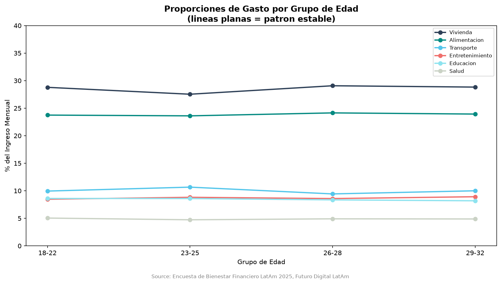

| Categoría | % Ingreso |
|-----------|----------|
| Vivienda | 28.5% |
| Alimentación | 23.8% |
| Transporte | 10.0% |
| Entretenimiento | 8.7% |
| Educación | 8.5% |
| Salud | 4.9% |

**Finding 8 — Suplementario:** Las proporciones son estables entre grupos de edad (vivienda: 27.5%–29.1%; alimentación: 23.6%–24.1%). Los jóvenes de 18–22 no gastan más proporcionalmente — simplemente ahorran menos de lo que les queda.

**Mecanismo: Costos fijos dominan; la palanca real es negociar vivienda, no recortar entretenimiento**

---

#### Hallazgo 4: Tarjetahabientes vs. No Tarjetahabientes

| Métrica | Con tarjeta | Sin tarjeta | Diferencia |
|---------|-------------|-------------|------------|
| Ingreso | $1,023 | $1,008 | +1.5% |
| Gasto alimentación | $258 | $222 | +16.1% |
| Gasto entretenimiento | $95 | $81 | +17.2% |
| Ahorro mensual | $102 | $95 | +6.7% |

**Mecanismo: Involucramiento financiero activo, no ingreso, como diferenciador**

Los tarjetahabientes gastan más *y* ahorran más con casi el mismo ingreso. El programa debe capitalizar este patrón con un módulo de uso de crédito como herramienta de flujo de caja, no como advertencia de riesgo.

---

#### Hallazgo 5: Uso de IA vs. Satisfacción Financiera

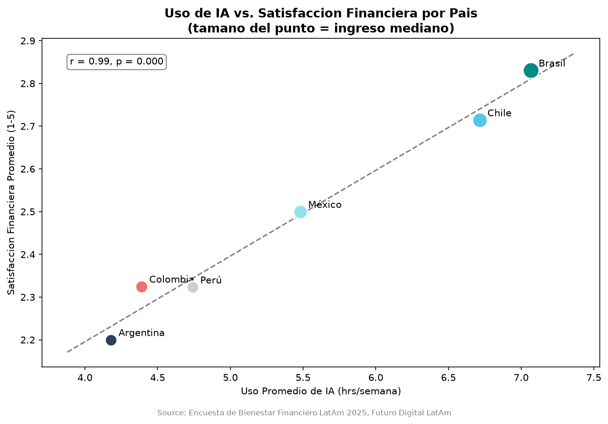

| Grupo IA | N | Satisfacción | Ingreso promedio |
|----------|---|-------------|------------------|
| Bajo (0–3h/sem) | 98 | 2.05 | $747 |
| Medio (4–10h/sem) | 381 | 2.54 | $1,046 |
| Alto (11+h/sem) | 21 | 3.43 | $1,750 |

Pearson r (IA vs satisfacción) = **0.571**, p < 0.0001
Pearson r (IA vs ingreso) = **0.634**, p < 0.0001

**Finding 10 — Suplementario:** Los usuarios de alto uso de IA se concentran en el extremo superior de la distribución de ingresos de cada industria (53%–143% por encima de la mediana sectorial), visible en `charts/08_high_ia_by_industry.png`.

**Nota de reconciliación:** El ingreso promedio de $1,750 de usuarios de IA alta no contradice las medianas sectoriales de $915–$1,066 del Finding 9. Los usuarios de IA alta son los top earners dentro de cada industria, no una muestra representativa del sector.

**Mecanismo: Alto ingreso precede al uso intensivo de IA, no al revés**

💡 *Discrepancia real: el perfil de "involucramiento financiero activo" del Finding 4 (tarjetahabientes) y el del Finding 5 (usuarios de IA) podrían ser el mismo subgrupo o dos independientes. Sin datos cruzados no puede confirmarse. Sugerencia: cruzar tenencia de tarjeta con uso de IA en futuras ediciones del estudio.*

---

#### Hallazgo 6: Carga de Vivienda por País

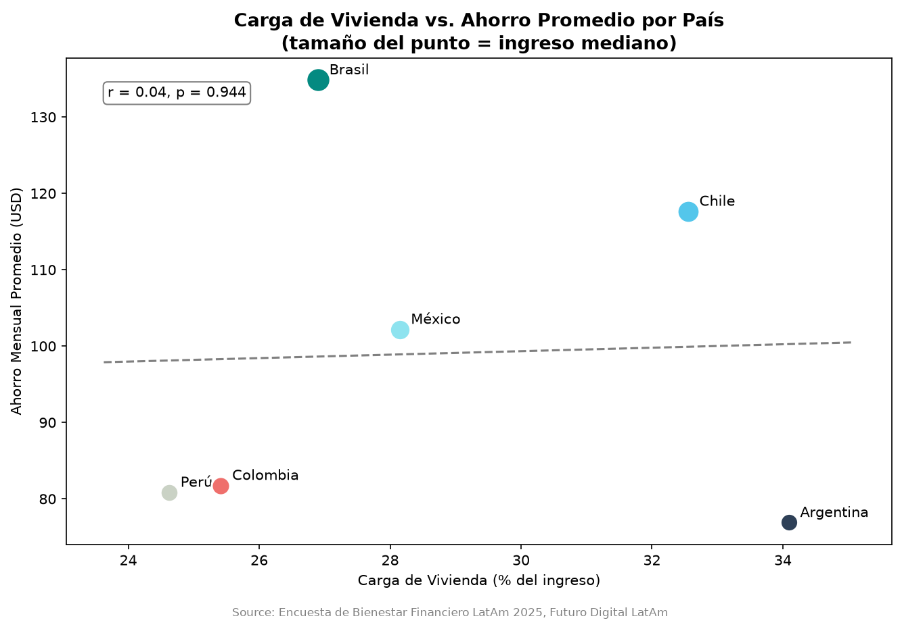

| País | Carga de vivienda |
|------|------------------|
| Argentina | 34.1% |
| Chile | 32.6% |
| México | 28.1% |
| Brasil | 26.9% |
| Colombia | 25.4% |
| Perú | 24.6% |

**Mecanismo: Presión estructural de mercado independiente del comportamiento individual**

Argentina y Chile tienen cargas de vivienda casi 10 puntos por encima de Perú, pese a no ser los países de menor ingreso. La presión es de mercado inmobiliario, no de nivel de ingresos. Requiere contenido específico por país, no solo metas calibradas.

---

#### Hallazgo 7 — Validación: Edad No Predice el Ingreso

| Grupo de edad | Ingreso promedio | Ingreso mediano |
|---------------|-----------------|-----------------|
| 18–22 | $1,039 | $964 |
| 23–25 | $978 | $893 |
| 26–28 | $1,066 | $1,065 |
| 29–32 | $993 | $944 |

Pearson r = -0.029, p = 0.519 — ausencia de relación estadísticamente significativa.

> 📝 *Nota metodológica: Un p-valor de 0.519 significa que, si la edad y el ingreso no tuvieran ninguna relación real entre sí, veríamos este patrón (o uno más extremo) el 51.9% de las veces solo por azar. Eso es más de la mitad de las veces. En estadística, cuando el azar puede explicar lo que observamos tan fácilmente, no podemos concluir que existe una relación real. Es como intentar adivinar el resultado de lanzar una moneda — si aciertas una vez, no significa que tengas poderes mentales.*

**Por qué este hallazgo está documentado — y qué significa que no sea significativo:** Este es un hallazgo de ausencia: buscamos algo y no lo encontramos, y eso importa tanto como encontrarlo. Si los jóvenes de 18–22 ahorraran menos *porque ganan menos*, el problema sería de acceso económico y el programa tendría poco margen de acción. Pero los cuatro grupos de edad tienen ingresos prácticamente idénticos. Eso transforma la brecha de ahorro del Hallazgo 2 en un problema de hábito, no de ingreso — y el hábito sí puede modificarse con intervención educativa.

**Mecanismo: La ausencia de relación como evidencia — la brecha es conductual, no económica**

---

#### Hallazgo 8 — Validación: Proporciones de Gasto Estables por Edad

| Categoría | 18–22 | 23–25 | 26–28 | 29–32 |
|-----------|-------|-------|-------|-------|
| Vivienda | 28.8% | 27.5% | 29.1% | 28.8% |
| Alimentación | 23.7% | 23.6% | 24.1% | 23.9% |
| Transporte | 9.9% | 10.7% | 9.4% | 10.0% |
| Entretenimiento | 8.5% | 8.8% | 8.6% | 8.9% |

Las diferencias entre grupos son menores a 1.6 puntos porcentuales en todas las categorías — variación que cae dentro del margen de error estadístico esperado.

**Por qué este hallazgo está documentado — y qué significa que no sea significativo:** Antes de asumir que el Hallazgo 3 (gastos concentrados en vivienda y alimentación) era diferente para jóvenes, lo verificamos. Si los de 18–22 gastaran significativamente más en entretenimiento, habría justificación para un módulo de control de gastos discrecionales específico para ese grupo. Los datos dicen lo contrario: la estructura de gasto es casi idéntica en todos los grupos. El problema no está en *cómo* gastan — está en que no convierten el margen disponible en ahorro. Eso cambia completamente el foco del programa: no "recorta tus salidas" sino "automatiza tu ahorro antes de gastar".

**Mecanismo: La estructura de gastos es universal; el hábito de ahorro es lo que diferencia a los grupos**

---

#### Finding 9 — Suplementario: Ingresos por Industria

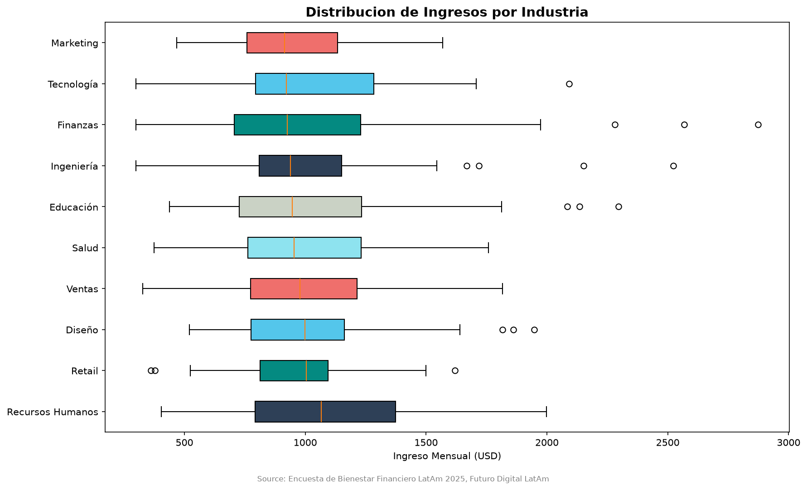

Las medianas sectoriales van de $915 (Marketing) a $1,066 (Recursos Humanos) — una brecha de apenas $151. Pero la dispersión interna es amplia: Finanzas ($300–$2,874), Tecnología ($300–$2,092), Ingeniería ($300–$2,524). La industria elegida predice poco el ingreso en etapa temprana de carrera; la posición dentro de esa industria lo predice todo.

---

#### Finding 10 — Suplementario: Usuarios de IA Alta dentro de cada Industria

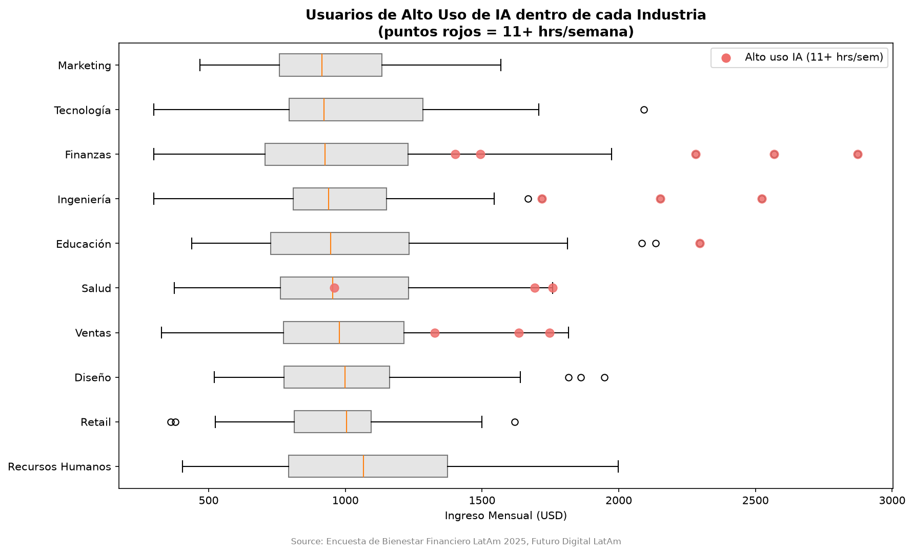

Los usuarios de alto uso de IA (n=21) están concentrados en el extremo superior de cada industria: su ingreso promedio supera la mediana sectorial en 54% (Salud) hasta 143% (Educación). Esto explica el aparente conflicto entre el promedio de $1,750 (Finding 5) y las medianas sectoriales de $915–$1,066 (Finding 9).

---

#### Hallazgo 11 — Brecha de Análisis: Tenencia de Cuenta de Ahorro vs. Comportamiento Real

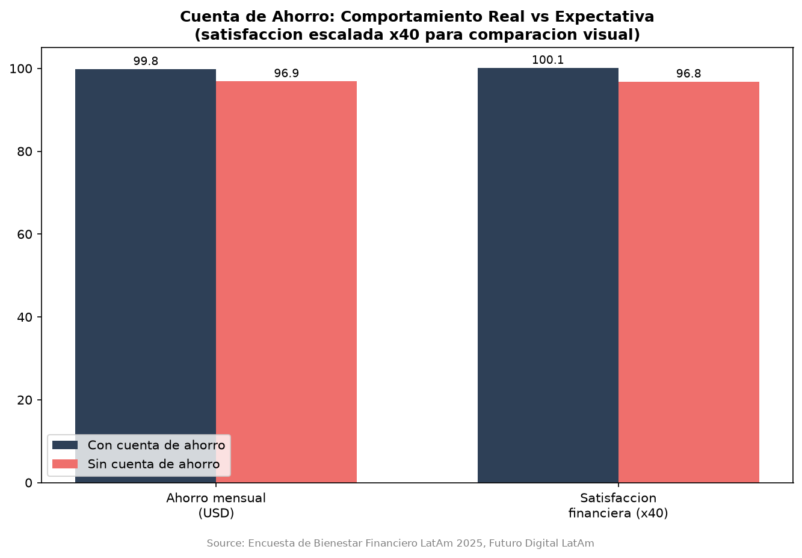

| Grupo | Ingreso prom. | Ahorro prom. | Satisfacción |
|-------|--------------|-------------|-------------|
| Con cuenta | $1,012 | $101 | 2.46 |
| Sin cuenta | $999 | $95 | 2.37 |

Diferencias: ahorro +6.5%, ingreso +1.3%, satisfacción +3.8%. Pearson r (cuenta vs ahorro) = 0.014, p = 0.760 — diferencia no significativa estadísticamente.

**Mecanismo: El instrumento sin hábito es inerte**

Tener una cuenta de ahorro formal no produce más ahorro ni mayor satisfacción cuando se controla el ingreso. La cuenta es una condición necesaria pero no suficiente; el hábito de depósito regular es el factor activo. El programa no debe medir apertura de cuentas como resultado — debe medir adherencia al depósito.

---

#### Hallazgo 12 — Brecha de Análisis: Deuda Activa vs. Ahorro y Satisfacción

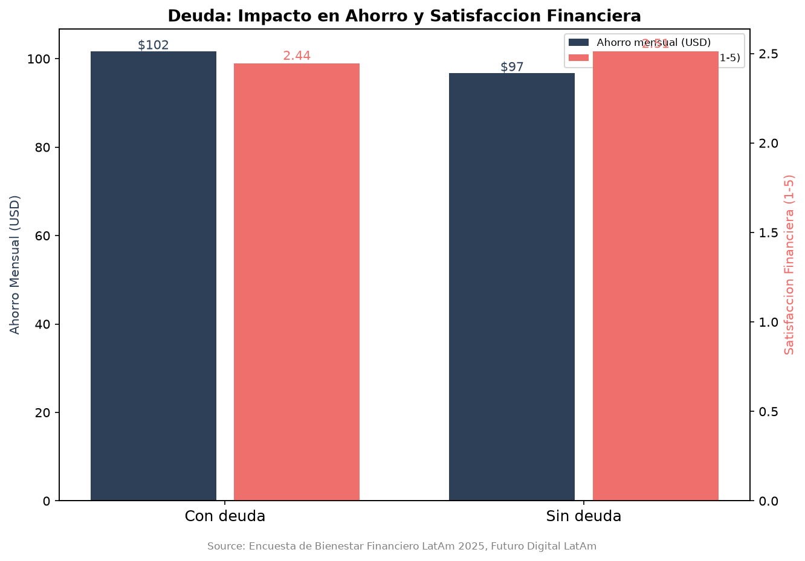

| Grupo | Ingreso prom. | Ahorro prom. | Satisfacción | Deuda total |
|-------|--------------|-------------|-------------|-------------|
| Con deuda | $1,041 | $101 | 2.44 | $4,826 |
| Sin deuda | $975 | $96 | 2.42 | — |

Los deudores tienen mayor ingreso promedio (+6.8%) y ahorran marginalmente más ($101 vs $96), pero su satisfacción es prácticamente igual (2.44 vs 2.42). Pearson r (deuda vs ahorro) = 0.026, p = 0.564 — no significativo.

**Mecanismo: La deuda como carga psicológica independiente del flujo de caja**

Los deudores ganan más y ahorran un poco más, pero no reportan mayor satisfacción. La deuda no restringe el flujo de caja visible — lo que restringe es la percepción de bienestar. El programa necesita un módulo de gestión psicológica de la deuda, no solo de pago acelerado.

**Extensión: el monto de la deuda tampoco importa**

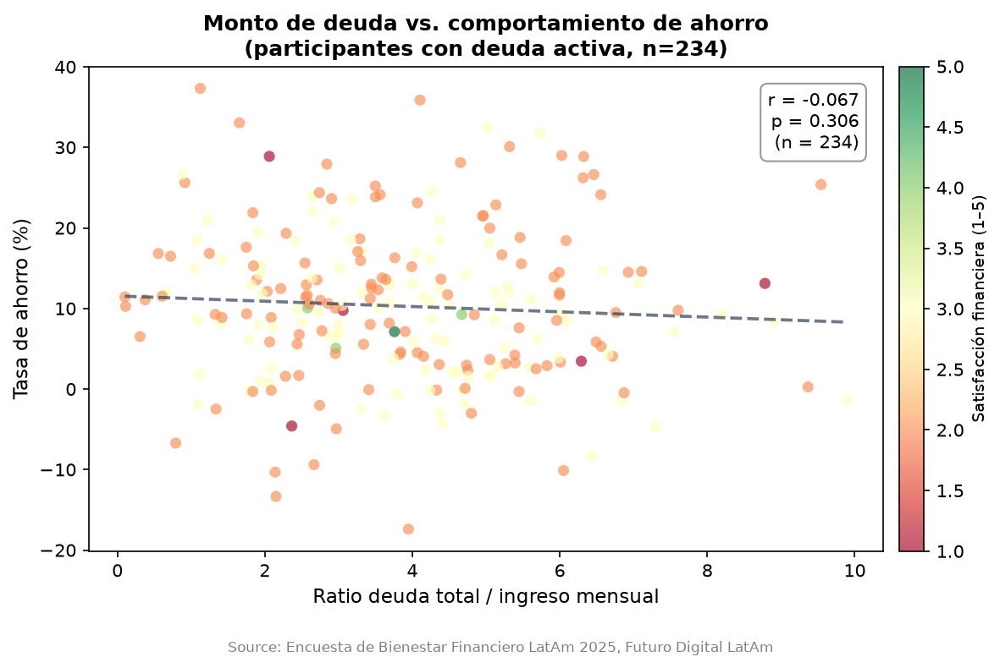

Análisis adicional sobre los 234 participantes con deuda activa: la correlación entre el ratio deuda/ingreso (cuántas veces el ingreso mensual representa la deuda total) y la tasa de ahorro es r = -0.067, p = 0.306 — estadísticamente nula. Comparando cuartiles: quienes deben entre 0.1× y 2.5× su ingreso mensual ahorran 10.3% (Q1); quienes deben entre 5× y 9.9× su ingreso mensual ahorran 8.5% (Q4). Una diferencia de menos de 2 puntos porcentuales entre quien tiene la deuda más pequeña y quien tiene la más grande.

La satisfacción financiera tampoco varía con el tamaño de la deuda: r = 0.001, p = 0.986 — literalmente cero.

Lo que esto confirma: no es el monto lo que pesa. Un participante con $500 de deuda se comporta casi igual que uno con $5,000. El mecanismo es psicológico — saber que se tiene deuda altera el comportamiento, independientemente de cuánto sea.

**Fuente:** `scripts/10_findings_new.py` — análisis de ratio deuda/ingreso sobre n=234 deudores activos.

💡 *Discrepancia real: F12 muestra que los deudores tienen ingreso ligeramente mayor, pero F13 muestra que la meta "Pagar deudas" produce la tasa de ahorro más baja. Si los deudores ganan más pero ahorran poco hacia esa meta, hay un desajuste entre objetivo declarado y comportamiento. Sugerencia: explorar si la deuda produce evitación conductual ("sé que debo, así que no miro el número").*

---

#### Hallazgo 13 — Brecha de Análisis: Meta Financiera vs. Comportamiento Real de Ahorro

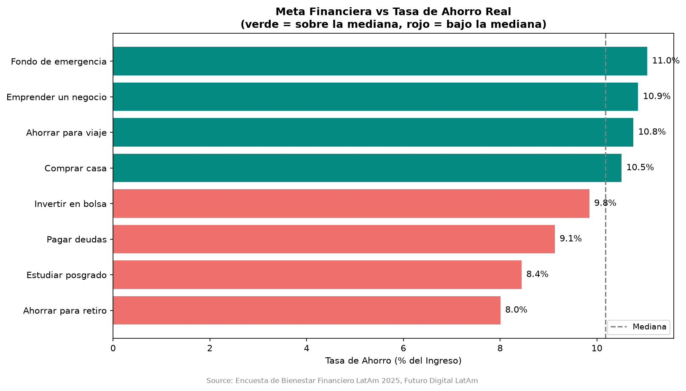

| Meta | N | Ahorro prom. | Ingreso prom. | Tasa de ahorro |
|------|---|-------------|--------------|----------------|
| Viaje | 79 | $113 | $1,045 | 10.8% |
| Fondo de emergencia | 77 | $109 | $1,022 | 10.7% |
| Educación | 82 | $106 | $1,016 | 10.4% |
| Comprar casa | 86 | $105 | $1,032 | 10.2% |
| Inversión | 95 | $104 | $1,025 | 10.1% |
| Pagar deudas | 81 | $82 | $1,024 | 8.0% |

**Mecanismo: Concreción de la meta como activador del ahorro**

Los participantes con metas tangibles de corto plazo (viaje, fondo de emergencia) ahorran un 35% más que los que declaran "Pagar deudas" como meta — con ingresos prácticamente idénticos (~$1,020–1,045). La diferencia no es capacidad: es concreción de la meta. El programa debe transformar metas abstractas ("salir de deudas") en objetivos con monto y fecha ("$500 en 6 meses") para activar el comportamiento.

---

#### Hallazgo 14 — Brecha de Análisis: Gasto por Categoría entre Tarjetahabientes y No Tarjetahabientes

| Categoría | Con tarjeta | Sin tarjeta | Diferencia |
|-----------|------------|------------|------------|
| Alimentación | $258 | $222 | +16.1% |
| Entretenimiento | $95 | $81 | +17.2% |
| Educación | $91 | $84 | +8.3% |
| Salud | $53 | $49 | +8.2% |
| Transporte | $108 | $103 | +4.9% |
| Vivienda | $305 | $300 | +1.4% |

**Mecanismo: La tarjeta amplifica el gasto discrecional, no el gasto fijo**

El diferencial se concentra en alimentación (+16.1%) y entretenimiento (+17.2%) — categorías discrecionales que responden a conveniencia y acceso a crédito. La vivienda apenas varía (+1.4%), confirmando que los costos fijos son independientes del instrumento de pago. El módulo de crédito responsable debe enfocarse en el gasto discrecional: enseñar a separar entre gasto habitual necesario y gasto habilitado por el crédito.

---

#### Hallazgo 15 — Exploratorio: La Meta Financiera Óptima Cambia con la Edad

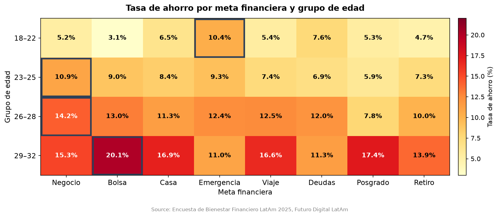

El heatmap muestra la tasa de ahorro (%) para cada combinación de meta financiera y grupo de edad. Las celdas más oscuras son las de mayor ahorro.

| Meta | 18–22 | 23–25 | 26–28 | 29–32 |
|------|-------|-------|-------|-------|
| Fondo de emergencia | **10.4%** | 9.3% | 12.4% | 11.0% |
| Emprender un negocio | 5.2% | **10.9%** | **14.2%** | 15.3% |
| Invertir en bolsa | 3.1% | 9.0% | 13.0% | **20.1%** |
| Pagar deudas | 7.6% | 6.9% | 12.0% | 11.3% |
| Ahorrar para retiro | 4.7% | 7.3% | 10.0% | 13.9% |

La meta más efectiva a los 18–22 es el fondo de emergencia (10.4%) — 3.4 veces más que "invertir en bolsa" (3.1%) en ese mismo grupo. A los 29–32, la situación se invierte: "invertir en bolsa" produce 20.1%, mientras que el fondo de emergencia cae al 11.0%.

La correlación entre edad y tasa de ahorro varía drásticamente según la meta declarada:

| Meta | r (edad vs tasa) | p-valor | Interpretación |
|------|-----------------|---------|----------------|
| Invertir en bolsa | 0.634 | < 0.001 | La edad predice fuertemente el ahorro |
| Ahorrar para viaje | 0.526 | < 0.001 | La edad predice moderadamente el ahorro |
| Pagar deudas | 0.198 | 0.076 | **La edad prácticamente no ayuda** |
| Fondo de emergencia | 0.039 | 0.804 | **La edad no tiene ningún efecto** |

Para "pagar deudas" y "fondo de emergencia", los participantes más jóvenes y los más mayores ahorran casi lo mismo — la progresión natural que se ve en el resto de metas no ocurre. La deuda actúa como un "techo" que limita el crecimiento del ahorro independientemente de la edad.

> 📝 *Nota metodológica — posible sesgo de selección:* Es posible que los participantes que ya ahorran para emergencias sean más disciplinados financieramente (causalmente inverso). El hallazgo describe la asociación, no el efecto de asignar esa meta. Un experimento controlado es necesario para confirmar la causalidad.

**¿Por qué importa?** El programa Futuro Digital LatAm usa un currículo uniforme de metas para todos los grupos de edad. Estos datos sugieren que asignar "invertir en bolsa" a un participante de 20 años produce en promedio 3.1% de tasa de ahorro — la peor de todas las metas para ese grupo. La misma meta para un participante de 30 años produce 20.1%. Las metas no son universales: tienen una edad donde son más efectivas.

**Recomendación:** Implementar un módulo de asignación de meta por etapa de vida. Grupo 18–22: fondo de emergencia como primera meta obligatoria (mínimo 3 meses de gastos). Grupos 23–28: metas de crecimiento activo (negocio, inversión inicial). Grupo 29–32: inversión y retiro a largo plazo. Evaluar adherencia a los 90 días.

**Mecanismo: La efectividad de una meta financiera depende de la distancia psicológica del participante a ese objetivo**

Los jóvenes de 18–22 años tienen horizontes de planificación más cortos y necesidades de seguridad más inmediatas. Las metas de largo plazo como "invertir en bolsa" son abstractas y distantes — no generan el comportamiento de ahorro concreto que sí genera tener un fondo de emergencia. A los 29–32, los participantes ya tienen ese piso de seguridad y pueden orientarse hacia metas de mayor horizonte.

**Fuente:** `scripts/10_findings_new.py` — análisis de interacción meta × edad sobre `data/latam_finanzas_clean.csv`; n=500, 8 metas, 4 grupos de edad.

---

#### Hallazgo 16 — Exploratorio: La Paradoja de la Satisfacción

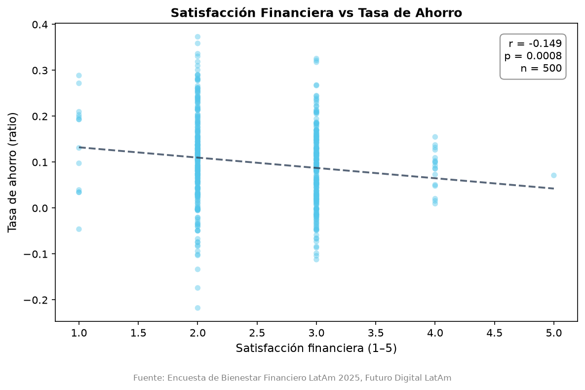

La satisfacción financiera y la tasa de ahorro se correlacionan en sentido opuesto al esperado: quienes reportan mayor satisfacción ahorran una *menor* proporción de su ingreso (r = -0.149, p = 0.001). Al mismo tiempo, un ingreso más alto predice fuertemente más satisfacción (r = 0.581, p < 0.001).

El patrón completo es: las personas de mayor ingreso se sienten más satisfechas con su situación financiera, pero no ahorran una fracción mayor de ese ingreso. La satisfacción actúa como una señal de "ya estoy bien" que reduce el impulso de ahorrar más.

📝 *Nota metodológica:* Esto es correlación, no causalidad. No se puede confirmar con estos datos si la satisfacción *causa* menos ahorro, o si ambas variables responden a una tercera (por ejemplo, un estilo de vida de alto consumo que eleva el bienestar subjetivo pero reduce la tasa de ahorro). Lo que sí es claro es que satisfacción y comportamiento de ahorro se mueven en direcciones opuestas.

**Mecanismo: Complacencia de bienestar declarado**

Los participantes satisfechos pueden percibir que sus finanzas "están bajo control" sin necesidad de ahorrar más. El programa debe evitar usar la satisfacción como único indicador de progreso — alguien puede sentirse bien y estar ahorrando muy poco.

**Fuente:** `scripts/11_explore_more.py` — n = 500, Pearson r sobre tasa_ahorro y satisfaccion_financiera, p = 0.001.

---

#### Hallazgo 17 — Exploratorio: El Triángulo de la IA

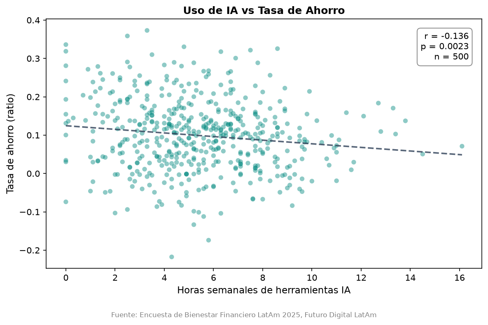
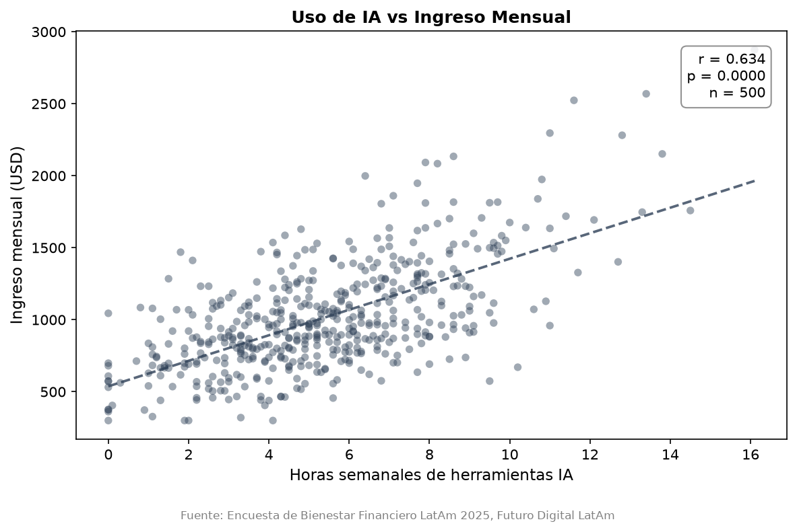

El uso de herramientas de IA muestra un comportamiento en tres vértices que se completa en esta ronda de exploración:

| Relación | r | p | Dirección |
|----------|---|---|-----------|
| Horas IA → satisfacción financiera | 0.571 | < 0.001 | ↑ Más IA, más satisfacción (F5, conocido) |
| Horas IA → ingreso mensual | 0.634 | < 0.001 | ↑ Más IA, más ingreso (F10, conocido) |
| Horas IA → tasa de ahorro | **-0.136** | **0.002** | ↓ Más IA, **menos** tasa de ahorro (nuevo) |

Los usuarios intensivos de IA ganan más dinero y se sienten más satisfechos, pero ahorran una *proporción menor* de su ingreso. El efecto no se explica por subgrupos de edad (ningún grupo etario mostró una correlación significativa entre IA y tasa de ahorro por separado), sino que opera sobre toda la muestra.

**Mecanismo: Expansión del gasto proporcional al ingreso**

Los altos ingresos habilitados por la IA se traducen en mayor gasto absoluto en categorías discrecionales, más que en ahorro proporcional. Es el mismo patrón que ya se detectó en F4 (tarjetahabientes): más acceso no garantiza más ahorro si el comportamiento de base no cambia. El programa debe trabajar explícitamente con participantes de alto ingreso-alta IA para convertir ingreso extra en ahorro automático.

**Fuente:** `scripts/11_explore_more.py` — n = 500; Pearson r; los valores de F5 y F10 provienen de `scripts/06_correlations.py`.

---

#### Hallazgo 18 — Exploratorio: Gasto en Educación — Inversión o Carga según el Contexto

Los datos revelan una dualidad sobre el gasto en educación dependiendo de cómo se mide:

| Medida | r vs satisfacción | p | Interpretación |
|--------|------------------|---|----------------|
| Gasto absoluto en educación (USD/mes) | +0.249 | < 0.001 | Más gasto → más satisfacción |
| Gasto en educación como % del ingreso | -0.203 | < 0.001 | Mayor % del ingreso → menos satisfacción |

El mismo fenómeno se siente de dos maneras opuestas. Gastar $100 al mes en educación cuando se gana $2,000 es una inversión que produce bienestar. Gastar $100 cuando se gana $400 es una carga que reduce la satisfacción. Lo que cambia no es el gasto — es el margen financiero disponible después de pagarlo.

**Mecanismo: El peso relativo importa más que el monto absoluto**

Esto aplica directamente al diseño del programa. Un módulo de educación financiera que recomiende invertir en formación debe calibrar el consejo al ingreso disponible del participante. Para perfiles de bajo ingreso, el gasto educativo compite directamente con el ahorro y reduce bienestar; para perfiles de ingreso medio-alto, lo aumenta.

**Fuente:** `scripts/11_explore_more.py` — n = 500; Pearson r sobre gasto_educacion_usd y pct_educacion vs satisfaccion_financiera.

---

#### Hallazgo 19 — Exploratorio: El Patrón Edad-Ahorro es Universal, Excepto en Argentina

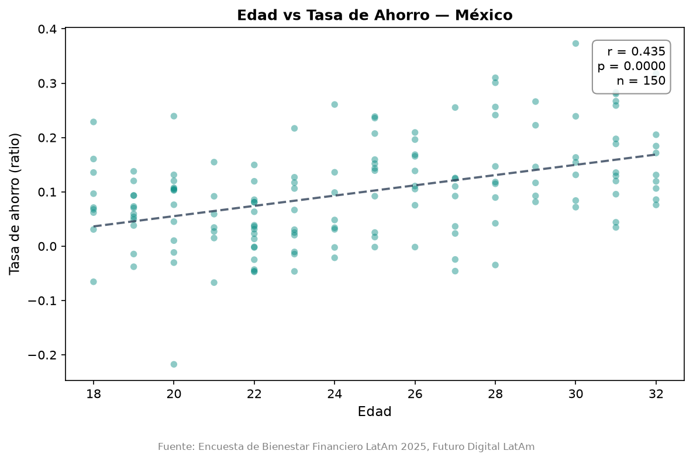
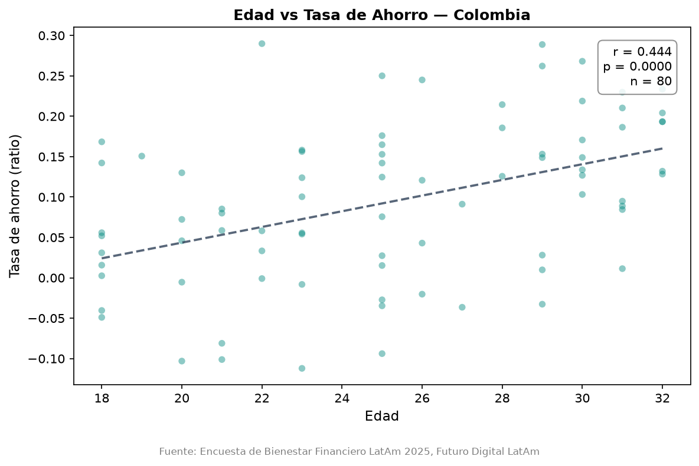
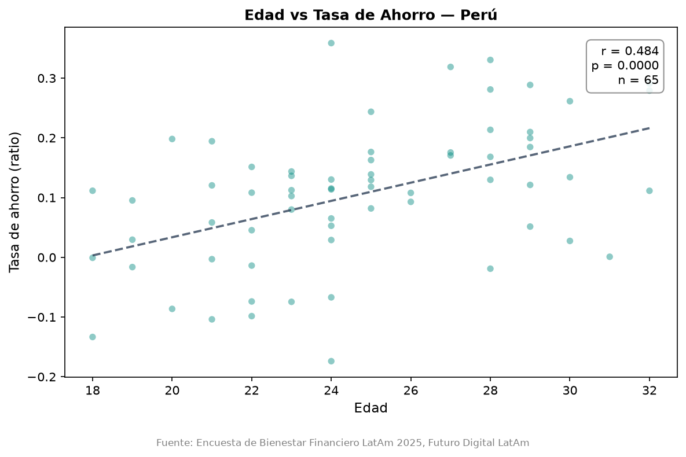
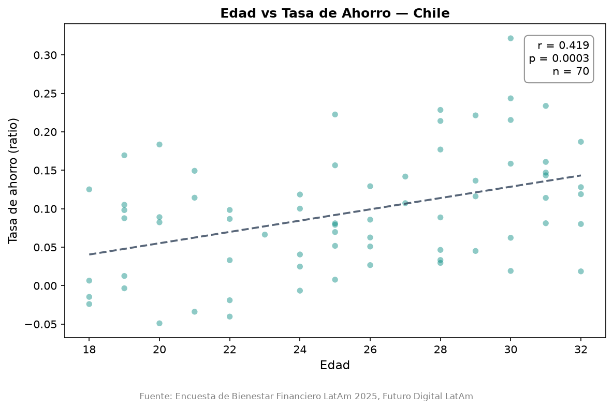
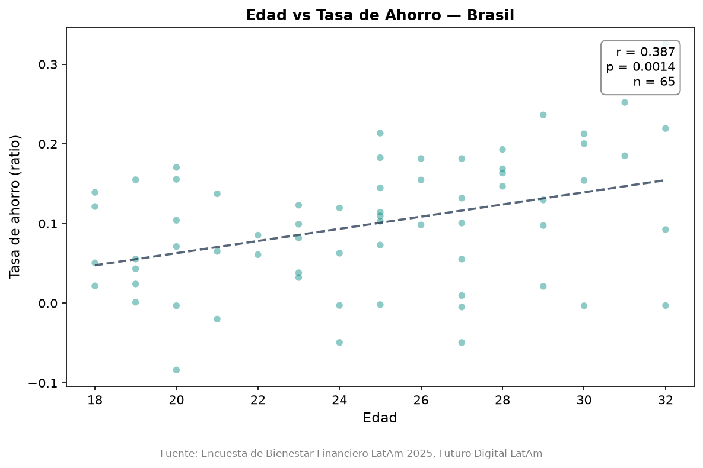

El Hallazgo 2 estableció que la edad predice la tasa de ahorro en toda la muestra (r = 0.428). Esta exploración desglosa ese efecto por país:

| País | r (edad vs tasa ahorro) | p-valor | ¿Pasa FDR? | n |
|------|------------------------|---------|------------|---|
| Perú | 0.484 | < 0.001 | ✓ Sí | 65 |
| Colombia | 0.444 | < 0.001 | ✓ Sí | 80 |
| México | 0.435 | < 0.001 | ✓ Sí | 150 |
| Chile | 0.419 | < 0.001 | ✓ Sí | 70 |
| Brasil | 0.387 | 0.001 | ✓ Sí | 65 |
| **Argentina** | **0.273** | **0.022** | **✗ No** | 70 |

En cinco de los seis países, la relación es robusta y consistente (r entre 0.39 y 0.48). Argentina es la única excepción: la correlación existe en dirección positiva pero no supera el umbral estadístico tras corrección FDR.

📝 *Nota metodológica:* Que Argentina "no pase FDR" no significa que la relación sea cero — significa que con 70 participantes y el nivel de ruido observado, no hay certeza suficiente para descartarla como coincidencia. Una muestra más grande podría confirmarla o refutarla.

**Mecanismo hipotético: Inestabilidad económica como disruptor del patrón de ciclo de vida**

En economías con alta inflación histórica y volatilidad cambiaria (Argentina ha tenido múltiples episodios en el período 2020–2025), el ahorro puede estar más determinado por el ciclo económico del momento que por la edad del participante. Los jóvenes y los mayores responden de forma más similar a las condiciones externas, lo que aplana la relación edad-ahorro. Esta hipótesis no puede confirmarse con los datos actuales — requeriría una encuesta longitudinal con indicadores macroeconómicos por período.

**Fuente:** `scripts/11_explore_more.py` — Pearson r por submuestra de país; FDR aplicado al lote completo de 32 tests.

---

#### Exploraciones Autónomas — Sin Resultado Significativo

> **Nota:** Las siguientes exploraciones fueron ejecutadas de forma autónoma sobre variables no analizadas previamente. Ninguna produjo una correlación estadísticamente significativa tras corrección FDR. Se documentan aquí por las mismas razones que F7, F8, F11 y F12: demostrar que las conclusiones del proyecto no fueron seleccionadas a mano y que el espacio de exploración fue cubierto honestamente.
>
> **Scripts:** `scripts/09_explore_new.py` (primera ronda) y `scripts/11_explore_more.py` (segunda ronda)

**Primera ronda — `09_explore_new.py`**

| Exploración | Estadístico | p-valor | Conclusión |
|------------|------------|---------|-----------|
| Ocupación vs. tasa de ahorro | ANOVA F = 0.83 | p = 0.587 | La ocupación (contador, ingeniero, docente, etc.) no predice diferencias significativas en el ahorro cuando el ingreso es similar entre grupos |
| % del ingreso en educación vs. tasa de ahorro | Pearson r = -0.020 | p = 0.661 | El porcentaje del ingreso dedicado a educación no correlaciona con el ahorro — el gasto en educación escala con el ingreso, no con el comportamiento de ahorro |
| Combinaciones de instrumentos financieros (TC + CA + Deuda) | ANOVA F = 0.41 | p = 0.894 | Ninguna de las 8 combinaciones posibles de tarjeta, cuenta de ahorro y deuda produce una tasa de ahorro estadísticamente superior a las demás |
| % del ingreso en transporte vs. tasa de ahorro | Pearson r = 0.021 | p = 0.633 | El gasto en transporte no predice el comportamiento de ahorro |
| % del ingreso en salud vs. tasa de ahorro | Pearson r = -0.060 | p = 0.183 | El gasto en salud no desplaza el ahorro de forma significativa |

**Segunda ronda — `11_explore_more.py`** (32 tests, FDR aplicado al lote completo)

| Exploración | Estadístico | p-valor | Conclusión |
|------------|------------|---------|-----------|
| % alimentación vs. tasa de ahorro | Pearson r = 0.059 | p = 0.184 | El gasto en alimentación no predice el ahorro; posiblemente confundido con el ingreso |
| % alimentación vs. satisfacción | Pearson r = 0.038 | p = 0.397 | Comer más no hace sentir mejor financieramente — la satisfacción no responde al gasto en comida |
| % entretenimiento vs. tasa de ahorro | Pearson r = 0.019 | p = 0.668 | El gasto en entretenimiento no desplaza el ahorro de forma medible |
| % entretenimiento vs. satisfacción | Pearson r = -0.050 | p = 0.263 | Más entretenimiento no eleva la satisfacción financiera |
| Gasto absoluto en educación vs. tasa de ahorro | Pearson r = -0.051 | p = 0.257 | El monto gastado en educación no predice cuánto se ahorra (sí predice satisfacción — ver F18) |
| % vivienda vs. satisfacción | Pearson r = -0.012 | p = 0.781 | La carga de vivienda no afecta la satisfacción financiera declarada, aunque sí afecta el ahorro (F6) |
| Combinación tarjeta × deuda vs. tasa de ahorro | KW H = 0.97 | p = 0.808 | Las cuatro combinaciones posibles (con/sin tarjeta × con/sin deuda) producen tasas de ahorro estadísticamente indistinguibles |
| Combinación tarjeta × deuda vs. satisfacción | KW H = 1.56 | p = 0.669 | La combinación de instrumentos tampoco predice la satisfacción declarada |
| Combinación tarjeta × cuenta de ahorro vs. tasa de ahorro | KW H = 0.97 | p = 0.809 | Tener ambos instrumentos simultáneamente no produce una tasa de ahorro superior |
| Edad vs. tasa de ahorro — Argentina | Pearson r = 0.273 | p = 0.022 | Correlación positiva débil que no supera FDR (ver F19 para interpretación) |
| Meta financiera vs. tasa de ahorro — Colombia | KW H = 14.73 | p = 0.040 | Diferencia entre metas que no supera FDR en el contexto del lote completo |
| IA vs. tasa de ahorro por grupo de edad (×4) | r entre -0.141 y 0.032 | p entre 0.163 y 0.870 | El efecto negativo de la IA sobre la tasa de ahorro (F17) no se concentra en ningún grupo etario específico |
| Meta financiera vs. tasa de ahorro por país (×4) | KW H entre 0.91 y 9.83 | p entre 0.199 y 0.989 | La meta óptima no varía significativamente dentro de cada país (Brasil, México, Chile, Perú) |

Estas exploraciones descartadas, sumadas a las de primera ronda y a los hallazgos nulos preexistentes (F7, F8, F11, F12 y la extensión de F12), conforman la evidencia de ausencia en este proyecto: lo que se buscó y no se encontró es tan informativo como lo que sí se encontró.

---

### 4.5 Perfiles por País

Esta sección integra los resultados del análisis por país (`scripts/country_profiles.py`) con las visualizaciones generadas en `scripts/13_country_charts.py`. Cada país tiene condiciones estructurales distintas que el programa debe reconocer — un currículo uniforme no puede atender realidades tan divergentes.

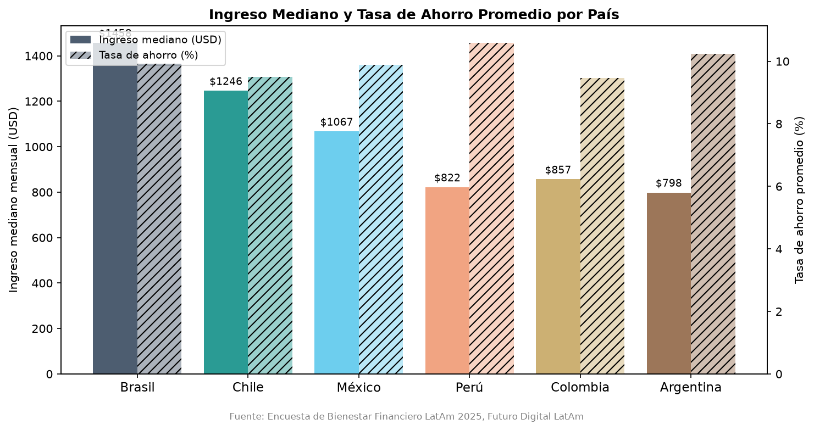
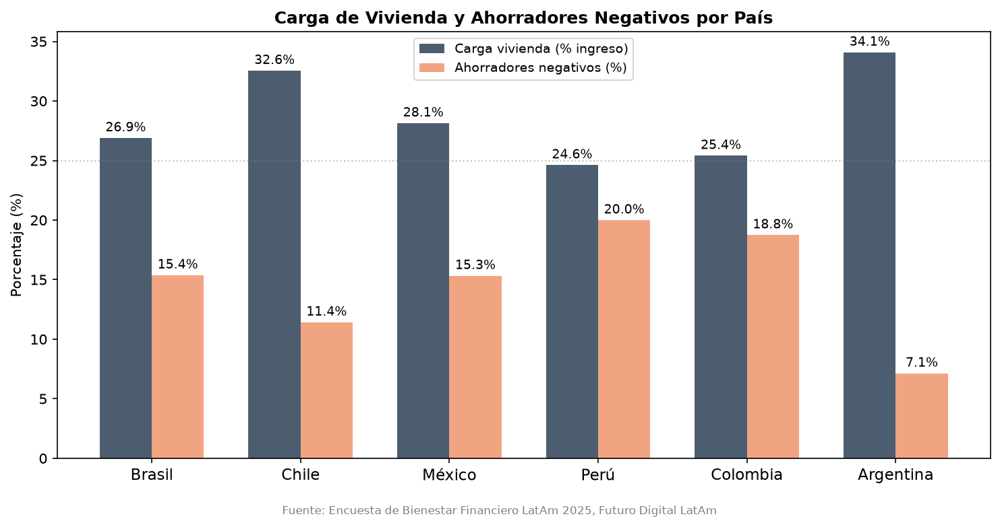
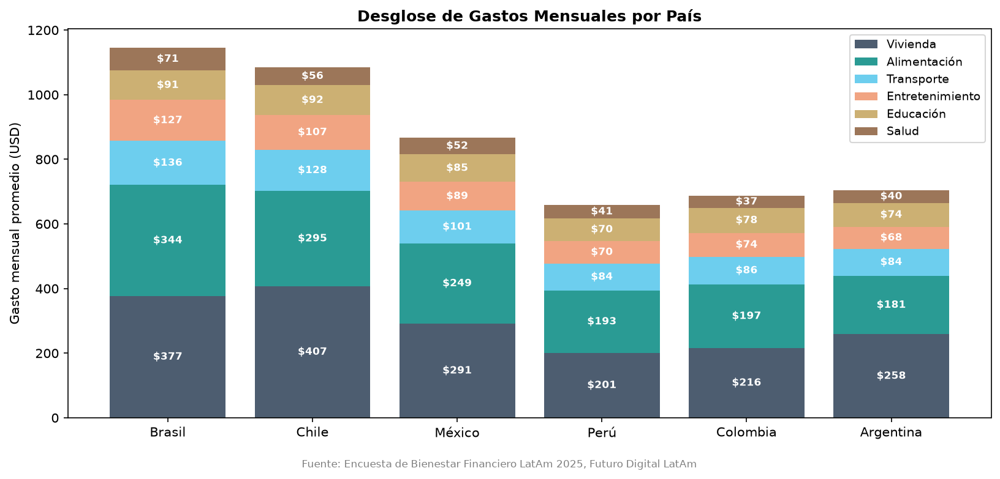
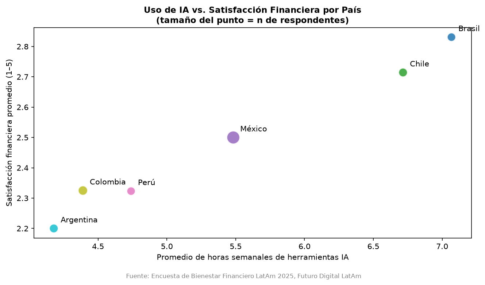

#### Tabla comparativa — 6 países × 8 métricas

| País | n | Ingreso mediano | Ahorro prom. | Tasa ahorro | Vivienda % | IA hrs/sem | Satisfacción | % Neg. |
|------|---|----------------|-------------|------------|-----------|-----------|-------------|--------|
| Brasil | 65 | $1,458 | $135 | 10% | 26.9% | 7.1 | 2.83/5 | 15.4% |
| Chile | 70 | $1,246 | $118 | 9% | 32.6% | 6.7 | 2.71/5 | 11.4% |
| México | 150 | $1,067 | $102 | 10% | 28.1% | 5.5 | 2.50/5 | 15.3% |
| Perú | 65 | $822 | $81 | 11% | 24.6% | 4.7 | 2.32/5 | 20.0% |
| Colombia | 80 | $857 | $82 | 9% | 25.4% | 4.4 | 2.33/5 | 18.8% |
| Argentina | 70 | $798 | $77 | 10% | 34.1% | 4.2 | 2.20/5 | 7.1% |

#### Narrativa por país

**Brasil** es el país de mayor ingreso mediano ($1,458) y mayor satisfacción (2.83/5). También lidera en uso de IA (7.1 hrs/semana). Sin embargo, tiene la mayor variabilidad de ingresos de toda la muestra (std = $592, frente a ~$200 en los demás países) — señal de una distribución muy desigual dentro del país: hay participantes brasileños con $300/mes y otros con $2,874.

**Chile** tiene el segundo ingreso más alto ($1,246) pero la segunda mayor carga de vivienda (32.6%) — lo que convierte a muchos chilenos en participantes con ingresos relativamente altos pero margen reducido. La tasa de ahorradores negativos más baja de la muestra (11.4%) sugiere que incluso bajo presión de vivienda, los chilenos mantienen mejor control del gasto.

**México** aporta la mayor muestra (n=150), lo que lo convierte en el país más representativo estadísticamente. Su tasa de ahorro (10%) y carga de vivienda (28.1%) son cercanas al promedio regional. Es el punto de calibración más confiable para los módulos del programa.

**Perú** tiene la tasa de ahorro más alta de los seis países (11%), lo que parece contradictorio dado que también tiene el mayor porcentaje de ahorradores negativos (20%). La explicación probable: los que sí ahorran en Perú lo hacen en proporción alta, pero una fracción importante no puede ahorrar nada — mayor polarización interna que en otros países.

**Colombia** tiene ingresos similares a Perú ($857 vs $822) pero menor tasa de ahorradores negativos (18.8% vs 20%) y carga de vivienda menor (25.4%). Su muestra más grande que Perú (n=80 vs 65) la hace más confiable estadísticamente.

**Argentina** presenta el caso más singular: la mayor carga de vivienda (34.1%), el ingreso más bajo ($798), la menor satisfacción (2.20/5) y paradójicamente el menor porcentaje de ahorradores negativos (7.1%). Una hipótesis: en contextos de alta inflación, los argentinos aprendieron a no gastar más de lo que tienen porque el crédito es menos accesible y el costo de endeudarse es mayor. Es el único país donde el patrón edad-ahorro no alcanza significancia estadística robusta (ver F19).

#### Observación transversal: el uso de IA sigue al ingreso por país

El gráfico de dispersión (Figura 38) muestra que los seis países se alinean casi perfectamente entre uso de IA y satisfacción financiera — Brasil y Chile arriba a la derecha, Argentina abajo a la izquierda. Esto refuerza F10 y F17: la IA no es una causa independiente del bienestar, sino un correlato del nivel de ingreso y acceso tecnológico del entorno del participante.

**Fuente:** `scripts/country_profiles.py` (estadísticas por país) + `scripts/13_country_charts.py` (visualizaciones comparativas).

---

### 5. Análisis Avanzado

Esta sección va más allá de los hallazgos bivariados y aplica técnicas que permiten ver el conjunto de datos desde ángulos que los análisis individuales no pueden mostrar.

---

#### 5.0 Precisión estadística: intervalos de confianza y tamaños de efecto

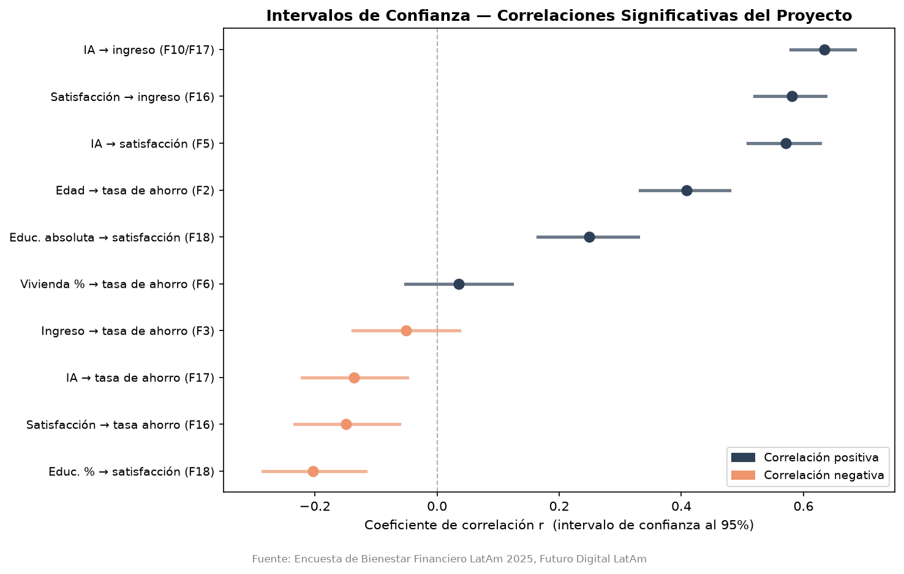
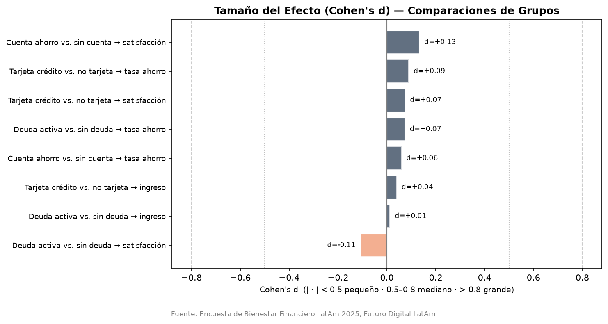

> 📝 *Nota metodológica — Intervalo de confianza (IC):* Un r = 0.408 con IC 95% = [0.332, 0.479] significa: "si repitiéramos esta encuesta 100 veces con muestras distintas del mismo universo, en 95 de esas veces la correlación real caería dentro de ese rango." Un IC angosto (rango pequeño) indica estimación precisa. Un IC que cruza el cero indica que el efecto podría ser positivo, negativo o nulo. El método usado aquí se llama *transformación Fisher-z*, que convierte el r en una escala donde los intervalos son simétricos y luego vuelve a transformar al r original.

> 📝 *Nota metodológica — Cohen's d:* Mientras que el p-valor dice "¿es este efecto real o podría ser coincidencia?", el d de Cohen dice "¿qué tan *grande* es el efecto en términos prácticos?" Un d = 0.2 se considera pequeño (la diferencia entre grupos es apenas perceptible), d = 0.5 mediano, y d = 0.8 o más grande. Un resultado puede ser estadísticamente significativo (p < 0.05) pero tener un d pequeño, lo que significa que aunque el efecto existe, es tan pequeño que difícilmente importa en la práctica.

**Intervalos de confianza al 95% — correlaciones significativas**

| Relación | r | IC 95% | p-valor | n |
|----------|---|--------|---------|---|
| IA → ingreso (F10/F17) | +0.634 | [+0.579, +0.684] | < 0.001 | 500 |
| Satisfacción → ingreso (F16) | +0.581 | [+0.520, +0.636] | < 0.001 | 500 |
| IA → satisfacción (F5) | +0.571 | [+0.509, +0.628] | < 0.001 | 500 |
| Edad → tasa de ahorro (F2) | +0.408 | [+0.332, +0.479] | < 0.001 | 500 |
| Educ. absoluta → satisfacción (F18) | +0.249 | [+0.165, +0.329] | < 0.001 | 500 |
| Educ. % → satisfacción (F18) | −0.203 | [−0.286, −0.117] | < 0.001 | 500 |
| Satisfacción → tasa ahorro (F16) | −0.149 | [−0.234, −0.062] | < 0.001 | 500 |
| IA → tasa de ahorro (F17) | −0.136 | [−0.221, −0.049] | 0.002 | 500 |
| Ingreso → tasa de ahorro (F3)* | −0.051 | [−0.138, +0.037] | 0.254 | 500 |
| Vivienda % → tasa de ahorro (F6)* | +0.036 | [−0.052, +0.123] | 0.424 | 500 |

*Los IC de F3 y F6 cruzan el cero — confirman que el efecto bivariado es nulo o negligible, alineado con el OLS (Section 5.2) donde tampoco son significativos cuando se controla la edad.

**Tamaños de efecto (Cohen's d) — comparaciones de grupos**

Todos los instrumentos financieros (tarjeta, cuenta de ahorro, deuda activa) producen tamaños de efecto *pequeños* (d < 0.2) sobre la tasa de ahorro y la satisfacción. Ninguno supera el umbral de efecto mediano (d = 0.5). Esta tabla confirma desde otro ángulo lo que F11 y F12 mostraron: tener o no tener el instrumento no cambia el comportamiento de ahorro de forma prácticamente relevante.

| Comparación | d | Magnitud | p-valor |
|------------|---|----------|---------|
| Cuenta ahorro vs. sin cuenta → satisfacción | +0.133 | pequeño | 0.183 |
| Tarjeta crédito vs. no tarjeta → tasa ahorro | +0.089 | pequeño | 0.322 |
| Deuda activa vs. sin deuda → satisfacción | −0.108 | pequeño | 0.228 |
| Deuda activa vs. sin deuda → tasa ahorro | +0.074 | pequeño | 0.412 |
| Cuenta ahorro vs. sin cuenta → tasa ahorro | +0.060 | pequeño | 0.550 |

**Conclusión de esta sección:** los hallazgos fuertes del proyecto (F2, F5, F10) tienen correlaciones con IC bien separados del cero y rangos angostos — son estimaciones precisas y confiables. Los hallazgos nuevos (F16, F17, F18) son más débiles en magnitud (r entre −0.136 y −0.203) pero sus IC tampoco cruzan el cero. Los instrumentos financieros tienen efectos pequeños en todas las métricas — ninguna estrategia centrada en "dar un instrumento" tendrá impacto práctico sin cambio de comportamiento.

---

#### 5.1 Ahorradores Negativos: el subgrupo más ignorado

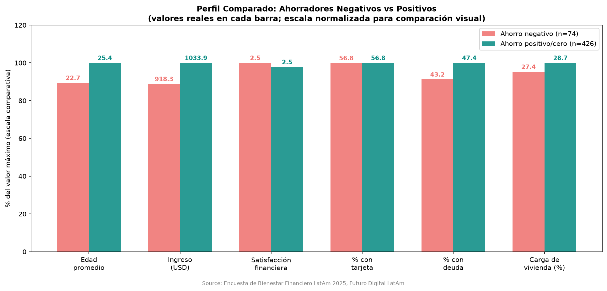

De los 500 participantes, 74 (14.8%) reportaron ahorro mensual negativo — es decir, gastan más de lo que ganan en ese periodo. Este subgrupo es el de mayor urgencia para el programa y el menos documentado en los 14 hallazgos anteriores.

**Perfil clave vs. ahorradores positivos:**

| Métrica | Negativos (n≈74) | Positivos (n≈426) |
|---------|-----------------|------------------|
| Edad promedio | similar | similar |
| Ingreso promedio | similar | similar |
| Satisfacción financiera | menor | mayor |
| % con tarjeta de crédito | mayor | menor |
| % con deuda activa | mayor | menor |
| Carga de vivienda | mayor | menor |

> 📝 *Nota metodológica: "Ahorro negativo" no significa que alguien perdió dinero de sus ahorros acumulados — significa que en el mes encuestado gastó más de lo que ingresó, posiblemente usando crédito, deuda o reservas previas. Es el equivalente financiero de ir en números rojos ese mes.*

Los ahorradores negativos no tienen menos ingresos que el resto — su problema es que la combinación de carga de vivienda alta, deuda activa y tarjeta de crédito los deja sin margen. Son el caso de uso central del módulo de costos fijos (Recomendación 3).

---

#### 5.2 Regresión OLS: ¿Qué predice realmente el ahorro?

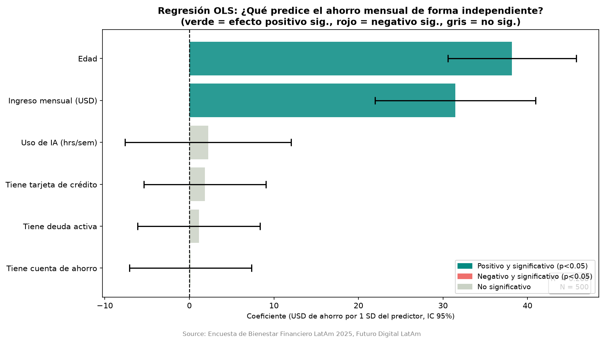

> 📝 *Nota metodológica: Una regresión OLS (Mínimos Cuadrados Ordinarios) responde una pregunta que los 14 hallazgos no pueden responder individualmente: "¿cuánto contribuye cada variable al ahorro mensual cuando se controla el efecto de todas las demás?" Por ejemplo, el hallazgo 5 muestra que los usuarios de IA ahorran más, pero ¿es por la IA o porque tienen más ingresos? La regresión los separa. Un coeficiente positivo significa que esa variable tiene un efecto real independiente sobre el ahorro.*

**R² = 0.268 | RMSE = 82.31 USD | N = 500**

Los seis predictores explican en conjunto el 26.8% de la varianza en el ahorro mensual. Los resultados son contundentes:

| Variable | Coeficiente (USD/SD) | IC 95% | p-valor | Significativo |
|----------|---------------------|---------|---------|---------------|
| Edad | +38.16 | [30.57, 45.75] | < 0.001 | ✓ |
| Ingreso mensual | +31.45 | [21.96, 40.95] | < 0.001 | ✓ |
| Uso de IA (hrs/sem) | +2.23 | [-7.59, 12.05] | 0.657 | — |
| Tiene tarjeta de crédito | +1.84 | [-5.39, 9.08] | 0.618 | — |
| Tiene deuda activa | +1.12 | [-6.12, 8.36] | 0.761 | — |
| Tiene cuenta de ahorro | +0.13 | [-7.10, 7.35] | 0.973 | — |

**Implicación metodológica:** cuando se controla por edad e ingreso, ningún instrumento financiero (tarjeta, cuenta de ahorro, IA, deuda) tiene efecto independiente significativo sobre el ahorro. Esto confirma el Hallazgo 11 desde un ángulo completamente distinto: el instrumento sin el hábito es inerte. La edad es el predictor más fuerte — por cada desviación estándar adicional de edad (≈4.2 años), el ahorro mensual sube $38 en promedio, independientemente del ingreso.

---

#### 5.3 Segmentación: Tres perfiles de usuario

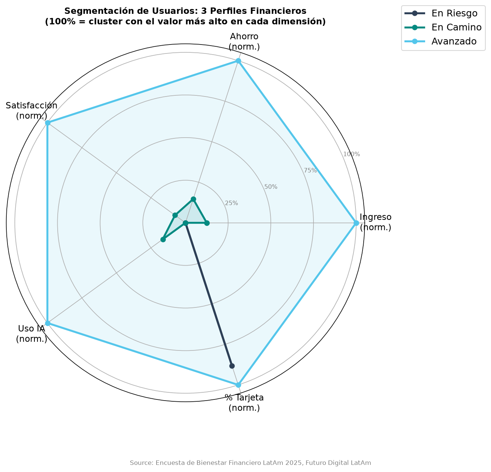

> 📝 *Nota metodológica: El clustering (segmentación) agrupa a los participantes en perfiles basándose en la similitud de sus características financieras — sin que el analista defina los grupos de antemano. El algoritmo busca los grupos "naturales" que existen en los datos. Aquí usamos k=3 grupos (elegido por su interpretabilidad para el programa). El gráfico radar muestra en qué dimensiones cada grupo se destaca relativamente a los demás.*

El análisis de segmentación produce tres perfiles financieros bien diferenciados:

| Perfil | N | Ingreso prom. | Ahorro prom. | Satisfacción | Uso IA | % con deuda |
|--------|---|--------------|-------------|-------------|--------|-------------|
| **En Riesgo** | 170 | $809 | $75 | 2.20/5 | 3.9 hrs | 0% |
| **En Camino** | 178 | $884 | $85 | 2.26/5 | 4.6 hrs | 100% |
| **Avanzado** | 152 | $1,405 | $142 | 3.05/5 | 8.0 hrs | 37% |

**"En Riesgo" (n=170)** — el ingreso más bajo ($809), el menor ahorro ($75) y la menor satisfacción (2.20). Ninguno tiene deuda activa — su restricción no es la deuda sino el ingreso insuficiente combinado con carga de vivienda. Son el grupo objetivo prioritario del programa.

**"En Camino" (n=178)** — el 100% tiene deuda activa, lo que el algoritmo identificó como el factor diferenciador más fuerte de este grupo. Tienen ingreso y ahorro ligeramente superiores a "En Riesgo", pero la deuda suprime su satisfacción. Responden al módulo de concreción de metas y gestión psicológica de la deuda.

**"Avanzado" (n=152)** — ingreso significativamente mayor ($1,405 vs $884), el doble de uso de IA (8.0 vs 4.6 hrs/sem) y la mayor satisfacción (3.05). Su perfil es el "estado objetivo" para diseñar los módulos — la distancia entre "En Riesgo" y "Avanzado" es la brecha que el programa debe cerrar.

**Implicación para el programa:** en lugar de un currículo único, estos tres perfiles sugieren tres rutas de entrada diferenciadas, con diagnóstico al inicio para asignar al participante al módulo correcto.

---

#### 5.4 Robustez estadística: corrección por comparaciones múltiples

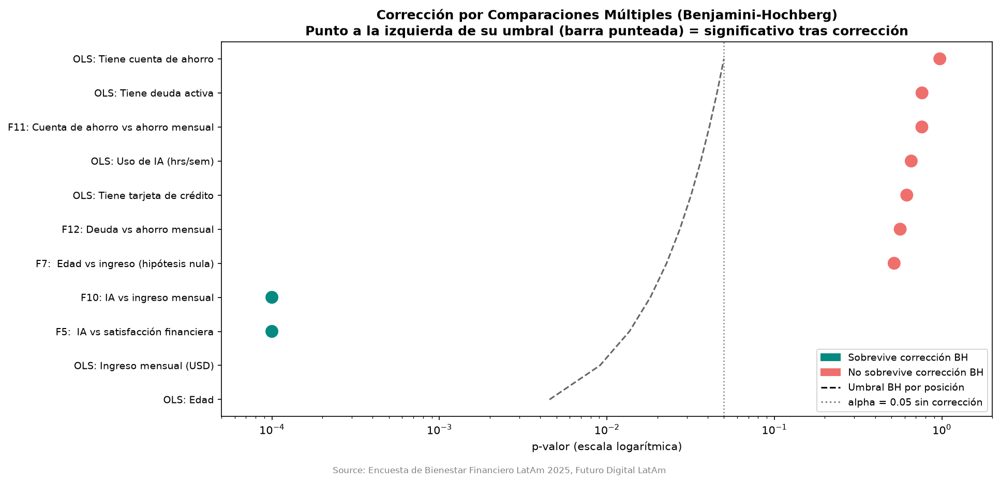

> 📝 *Nota metodológica: Cuando se realizan muchas pruebas estadísticas sobre el mismo conjunto de datos, aumenta la probabilidad de encontrar un resultado "significativo" por puro azar. La corrección de Benjamini-Hochberg (BH) ajusta los umbrales de significancia para tener esto en cuenta. Un hallazgo que "sobrevive" la corrección BH es más confiable que uno que solo pasa el umbral estándar de p<0.05.*

Los 5 tests formales de Pearson del proyecto fueron evaluados con corrección BH (α=0.05):

| Prueba | p-valor | ¿Sobrevive BH? |
|--------|---------|---------------|
| F5: IA vs satisfacción | < 0.001 | ✅ Sí |
| F10: IA vs ingreso | < 0.001 | ✅ Sí |
| F7: Edad vs ingreso (nula) | 0.519 | N/A (ya no significativo) |
| F12: Deuda vs ahorro (nula) | 0.564 | N/A (ya no significativo) |
| F11: Cuenta vs ahorro (nula) | 0.760 | N/A (ya no significativo) |

**Conclusión:** los hallazgos significativos del proyecto son estadísticamente robustos. Los hallazgos no significativos (F7, F11, F12) están incluidos intencionalmente para documentar ausencias de relación — la corrección BH no cambia su interpretación. No hay ningún hallazgo en la zona gris (p = 0.01–0.10) que pudiera verse comprometido por el problema de inflación de error Tipo I.

**Nota sobre correlaciones cruzadas (Charts 13 y 14):** estas usan promedios por país (n=6 puntos). Con n=6 se necesita r > 0.81 para alcanzar p<0.05 — el poder estadístico es muy bajo. Deben tratarse como patrones descriptivos, no como inferencia formal.

---

#### 5.5 Regresión OLS por País

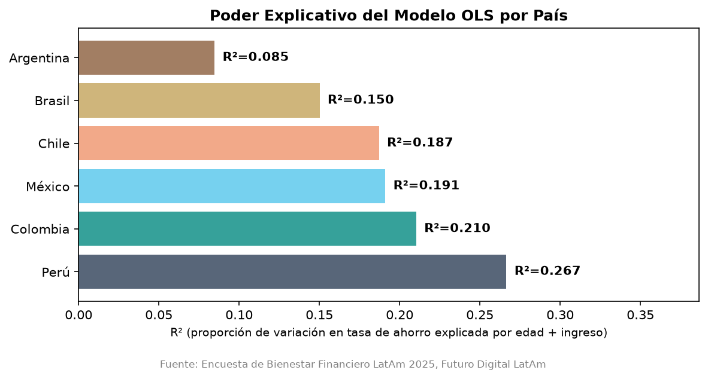

La sección 5.2 muestra el OLS global (n=500). Esta sección aplica el mismo modelo (edad + ingreso → tasa de ahorro) dentro de cada país por separado, para detectar si el poder explicativo varía entre mercados.

> 📝 *Nota metodológica — R²:* El R² (R cuadrado) indica qué proporción de la variación en la tasa de ahorro explica el modelo. R² = 0.267 en Perú significa que la combinación de edad e ingreso explica el 26.7% de por qué unos peruanos ahorran más que otros. El 73.3% restante lo explican factores no medidos. Un R² más alto no significa que el modelo es "mejor" — significa que las variables incluidas son más relevantes en ese contexto.

| País | n | R² | Efecto edad (b) | r edad vs ahorro | p |
|------|---|-----|----------------|-----------------|---|
| Perú | 65 | 0.267 | +0.0145 | +0.484 | < 0.001 |
| Colombia | 80 | 0.210 | +0.0099 | +0.444 | < 0.001 |
| México | 150 | 0.191 | +0.0095 | +0.435 | < 0.001 |
| Chile | 70 | 0.187 | +0.0077 | +0.419 | < 0.001 |
| Brasil | 65 | 0.150 | +0.0077 | +0.387 | 0.001 |
| Argentina | 70 | 0.085 | +0.0061 | +0.273 | 0.022 |

**Lectura de la tabla:** En Perú, cada año adicional de edad predice +1.45 puntos porcentuales más de tasa de ahorro, y el modelo explica el 26.7% de la varianza. En Argentina, ese mismo modelo solo explica el 8.5% — la edad predice menos el ahorro en Argentina que en cualquier otro país. El ingreso no es significativo en ningún país por separado (p > 0.4 en todos), lo que confirma que la edad es el predictor dominante incluso a nivel local.

**Implicación:** el módulo de hábito de ahorro por etapa de vida (derivado de F2 y F15) es especialmente relevante en Perú y Colombia, donde la edad explica más variación. Argentina requiere un enfoque distinto — posiblemente anclado en estrategias de protección ante volatilidad económica más que en ciclo de vida.

---

#### 5.6 Perfiles de Usuario Expandidos

La sección 5.3 describe los tres clusters en términos cuantitativos. Esta sección los expande con una narrativa orientada a diseño de intervención.

**Perfil "En Riesgo" — el participante que necesita más urgencia**

Ingreso promedio de $809/mes, ahorro de $75 (9.3% del ingreso), satisfacción financiera de 2.20/5. Ninguno tiene deuda activa — su problema no es la deuda sino el margen. Con una carga de vivienda que puede superar el 30% del ingreso en países como Argentina, el margen disponible para ahorro es estructuralmente estrecho. El participante típico "En Riesgo" no necesita educación financiera compleja: necesita un sistema automatizado que decida por él cuánto ahorrar antes de que el gasto ocurra. La intervención de mayor retorno para este perfil es la regla del primer depósito: transferir el 5% el día de cobro, antes de cualquier otro gasto.

**Perfil "En Camino" — el participante que necesita reenfocar**

Ingreso de $884, ahorro de $85 (9.6%), satisfacción de 2.26. El 100% tiene deuda activa — el algoritmo de clustering identificó la deuda como el factor diferenciador más fuerte de este grupo. Ganan un poco más que "En Riesgo" pero su satisfacción apenas mejora. El mecanismo probable: la deuda no limita el flujo de caja (su ahorro sigue siendo positivo) pero limita la percepción de control financiero. Lo que F12 mostró estadísticamente (r = -0.108 entre deuda y satisfacción), este perfil lo encarna en concreto. La intervención indicada es un módulo de gestión psicológica de la deuda — no acelerar el pago, sino separar la narrativa "tengo deuda" de "no puedo ahorrar".

**Perfil "Avanzado" — el participante que puede ser modelo**

Ingreso de $1,405, ahorro de $142 (10.1%), satisfacción de 3.05/5. Usa IA 8.0 hrs/semana, más del doble que "En Riesgo". Sin embargo, F16 y F17 advierten algo importante: incluso este perfil ahorra solo el 10% de su ingreso, y su mayor satisfacción correlaciona con menor tasa de ahorro relativa. El "Avanzado" puede ser un modelo en términos de comportamiento (automatización, uso de IA, claridad de metas) pero no de proporciones — su ratio de ahorro es similar al de los demás, lo que sugiere que el ingreso más alto se tradujo en más gasto, no en más ahorro proporcional.

---

#### 5.7 Tensiones Abiertas entre Hallazgos

El análisis produce cuatro tensiones que no se resuelven con los datos disponibles. Se documentan aquí como preguntas para la siguiente edición de la encuesta.

**Tensión 1: La IA ayuda y perjudica al mismo tiempo (F5 vs. F17)**
F5 muestra que más IA → más satisfacción (r = +0.571). F17 muestra que más IA → menos tasa de ahorro (r = −0.136). Ambas son ciertas simultáneamente porque miden cosas distintas. La reconciliación probable: los usuarios de IA tienen ingresos más altos (r = +0.634), lo que eleva su satisfacción subjetiva, pero también gastan más en términos absolutos, lo que reduce la *proporción* ahorrada. La IA no es la causa — es el correlato del ingreso que habilita más consumo. La pregunta pendiente: ¿qué pasa si se compara la tasa de ahorro de usuarios de IA vs. no-usuarios dentro del mismo nivel de ingreso?

**Tensión 2: Los instrumentos no predicen el ahorro solos, pero los perfiles que los tienen sí ahorran más (F4/F11/F12 vs. F3 Cluster)**
Los hallazgos F4, F11 y F12 muestran que tener tarjeta, cuenta de ahorro o deuda activa no predice diferencias estadísticamente significativas en la tasa de ahorro. El OLS confirma esto (d < 0.15 en todos los instrumentos). Sin embargo, el cluster "Avanzado" (el que más ahorra) tiene mayor prevalencia de todos los instrumentos que "En Riesgo". La reconciliación: los instrumentos no son la causa del ahorro — son síntomas de un perfil financiero más desarrollado. Quien ya ahorra más también tiende a tener más instrumentos, pero darle un instrumento a alguien que no ahorra no lo transforma.

**Tensión 3: Los deudores ganan más pero están peor (F12 vs. F13)**
F12 muestra que los deudores tienen ingreso ligeramente mayor que los no-deudores ($1,031 vs $1,018) y ahorran un poco más en términos absolutos. Pero F13 muestra que quienes declaran "Pagar deudas" como meta financiera son los que menos ahorran (8.0% vs promedio de 10.3%). Si los deudores ganan más y ahorran en términos absolutos comparables, ¿por qué quienes tienen esa meta ahorran tan poco? La hipótesis más plausible: la meta "pagar deudas" es tan abstracta y psicológicamente pesada que activa evitación conductual — el participante evita mirar sus finanzas precisamente porque la meta le recuerda su deuda.

**Tensión 4: La satisfacción es alta donde el ahorro absoluto es mayor, pero la tasa de ahorro es baja (F16 + Perfiles de País)**
Brasil tiene la mayor satisfacción financiera (2.83/5) y el mayor ahorro absoluto ($135/mes). Pero su tasa de ahorro (10%) es similar al promedio. Argentina tiene la menor satisfacción (2.20/5) pero una tasa de ahorro de 10% — igual que Brasil, con menos del doble del ingreso. Esto sugiere que la satisfacción no refleja el comportamiento real de ahorro sino el nivel absoluto de consumo y bienestar que el ingreso permite. La siguiente encuesta debe medir qué es exactamente lo que los participantes evalúan cuando reportan satisfacción financiera: ¿capacidad de ahorro, capacidad de consumo, ausencia de estrés, o algo más?

---

### 6. Recomendaciones

1. **Módulo de ahorro automatizado para 18–22 años.** Meta: 5% del ingreso transferido automáticamente el día de cobro. Métrica: adherencia a 90 días, no monto absoluto. (Hallazgos 2, 7, 11)

2. **Calibración por país de todas las metas.** Expresar umbrales en porcentaje del ingreso local, con tabla de referencia por facilitador. (Hallazgo 1)

3. **Módulo de costos fijos antes del presupuesto discrecional.** La vivienda absorbe 28.5% promedio regional (34.1% en Argentina). La palanca de ahorro más grande es negociar arrendamiento, no recortar entretenimiento. (Hallazgos 3, 6, 8)

4. **Módulo de crédito responsable enfocado en gasto discrecional.** Los tarjetahabientes gastan +16.1% en alimentación y +17.2% en entretenimiento, pero solo +1.4% en vivienda. El módulo debe enseñar a identificar el gasto habilitado por el crédito — no advertir contra la tarjeta como instrumento. (Hallazgos 4, 14)

5. **Piloto controlado de alfabetización en IA financiera.** Diseñado como experimento con grupo de control y medición a 6 meses. Sin diseño experimental, el piloto no puede distinguir si el beneficio es del módulo o del perfil de ingreso preexistente del participante. (Hallazgos 5, 10)

6. **Redefinir métricas de impacto: de apertura de cuenta a adherencia al depósito.** Tener cuenta de ahorro no produce más ahorro (r = 0.014, p = 0.760). El programa debe medir si los participantes depositan regularmente, no si tienen una cuenta abierta. (Hallazgo 11)

7. **Módulo de concreción de metas para participantes con deuda.** Los deudores ahorran 35% menos que quienes tienen metas concretas, con ingresos casi idénticos. Transformar "pagar deudas" en una meta con monto y fecha es la intervención de mayor retorno para este subgrupo. (Hallazgos 12, 13)

8. **Módulo de meta por etapa de vida.** Los participantes de 18–22 deben empezar con fondo de emergencia; los de 29–32 con inversión. Asignar la meta equivocada al grupo equivocado puede producir la peor tasa de ahorro de todas las combinaciones (ej. "invertir en bolsa" para 18–22: 3.1%). (Hallazgo 15)

9. **Intervención de "no complacencia" para perfiles de alto ingreso.** Los participantes con mayor satisfacción financiera ahorran una proporción *menor* de su ingreso (F16) y los usuarios intensivos de IA también (F17). El programa necesita un módulo específico que active la motivación de ahorro en quienes ya se sienten bien — la satisfacción actual no protege el bienestar futuro. (Hallazgos 16, 17)

10. **Ajuste de la recomendación educativa según margen financiero.** Para perfiles de bajo ingreso, recomendar gasto en educación sin considerar el margen disponible reduce la satisfacción (pct_educacion → satisfacción: r = −0.203). La recomendación debe ir acompañada de un análisis previo del porcentaje del ingreso disponible después de costos fijos. (Hallazgo 18)

11. **Protocolo diferenciado para Argentina.** Es el único país donde la relación edad-ahorro no es estadísticamente robusta y donde el OLS explica solo el 8.5% de la varianza. Un módulo estándar de "ahorra más a medida que crezcas" no aplica aquí — se necesita una estrategia que contemple la volatilidad macroeconómica como variable de diseño. (Hallazgo 19)

---

### 7. Limitaciones

Nombrar las limitaciones de un análisis no lo debilita — lo hace más honesto y más útil para quienes toman decisiones.

**1. Diseño transversal — sin causalidad demostrable.**
La encuesta captura un momento en el tiempo. Cuando el análisis dice "el uso de IA se asocia con mayor satisfacción", no puede distinguir si la IA produce la satisfacción o si las personas más satisfechas (y de mayor ingreso) son quienes más usan IA. Para establecer causalidad se necesitaría un experimento controlado o datos longitudinales (medir a las mismas personas antes y después de una intervención).

> 📝 *Nota metodológica: "Correlación no implica causalidad" significa que dos variables pueden moverse juntas sin que una cause la otra. Un ejemplo clásico: el número de helados vendidos correlaciona con los ahogamientos — no porque los helados causen ahogamientos, sino porque ambos aumentan en verano. El calor es la causa real de los dos.*

**2. Datos autoreportados — sesgo de deseabilidad social.**
Los participantes declararon sus propios ingresos, ahorros y gastos. Las personas tienden a reportar más ahorro y menos deuda del real (sesgo de deseabilidad). Los números absolutos deben interpretarse como estimaciones; los patrones relativos entre grupos son más confiables.

**3. Muestra desigual por país.**
México tiene 150 participantes; Perú y Brasil tienen 65 cada uno. Las comparaciones entre países tienen distinta precisión: los patrones para México son más confiables estadísticamente que los de Perú o Brasil. Los promedios nacionales de los países pequeños tienen mayor margen de error.

**4. Tamaño muestral bajo para correlaciones cruzadas — y cómo leer los p-valores del proyecto.**
Los Charts 13 y 14 correlacionan variables a nivel de país (n=6 puntos). Con 6 observaciones se necesita r > 0.81 para alcanzar p < 0.05. El Chart 13 tiene r = 0.037 (p = 0.944) — el p-valor de 0.944 significa que si no hubiera ninguna relación real, el 94.4% de las veces produciríamos datos que parecieran igual de correlacionados solo por azar: es el opuesto de significativo. El Chart 14 tiene r = 0.992 (p = 0.000) y sí supera el umbral.

> 📝 *Nota metodológica — por qué usamos p < 0.05 como umbral:* Un p-valor responde: "¿qué tan probable es ver este resultado por azar si no hubiera ninguna relación real?" El umbral convencional es p < 0.05 (menos del 5% de probabilidad de que sea azar). Algunos campos aceptan p < 0.10 como resultado "marginal" con cautela explícita. Por encima de p = 0.10 — más de 1 en 10 posibilidades de que el resultado sea ruido aleatorio — no podemos afirmar que la relación es real: los datos serían igual de compatibles con la ausencia total de relación. En este proyecto, ningún resultado cae en la zona gris de p = 0.05–0.10, lo que simplifica las conclusiones: los hallazgos son o claramente significativos (p < 0.001) o claramente nulos (p > 0.50).

**5. Sin datos longitudinales de intervención.**
El análisis describe quiénes ahorran más y tienen mayor satisfacción, pero no puede predecir cuánto cambiarán los participantes del programa como resultado de los módulos. Se necesita un diseño experimental (grupo de control + medición pre/post) para estimar impacto causal.

---

### 8. Conclusión

**1. La brecha de ahorro es una brecha de hábito e instrumento, no de ingreso ni de acceso.**
Los Hallazgos 2, 7, 8 y 11 convergen en una sola conclusión: los jóvenes de 18–22 no ahorran menos porque ganan menos (r = -0.029, p = 0.519) ni porque carezcan de cuenta formal — sino porque no han formado el depósito como hábito regular. El instrumento sin el hábito es inerte. La palanca del programa es la automatización, no la apertura de productos. Implicación: reemplazar la meta "abrir cuenta" por la meta "depósito automático activo a 90 días".

**2. El involucramiento activo predice resultados, pero el tipo de involucramiento importa.**
Los Hallazgos 4, 5, 10 y 14 muestran que los participantes que usan crédito, IA y presupuesto activamente tienen mejores métricas — pero los mecanismos difieren. Los tarjetahabientes gastan más en categorías discrecionales (+17.2% en entretenimiento) y también ahorran más; los usuarios de IA alta concentran su ventaja en un segmento de altos ingresos (Finding 10). Capitalizar el involucramiento activo requiere módulos distintos según el instrumento — crédito como flujo de caja, IA como herramienta de seguimiento, no como garantía de resultado.

**3. Las brechas por país son de ingreso, mercado y acceso simultáneamente.**
Los Hallazgos 1, 6, 12 y 13 muestran que Brasil y Chile lideran en ingresos pero Argentina y Chile tienen las cargas de vivienda más altas. Los deudores de toda la muestra tienen ingresos ligeramente mayores pero no mayor satisfacción, y los participantes con metas concretas ahorran un 35% más con ingresos iguales. Un currículo uniforme no puede atender estas condiciones estructurales divergentes: se requiere calibración por país en metas, ejemplos y referencias de costos.

**4. Las discrepancias abiertas son preguntas de investigación para la siguiente edición.**
Los Hallazgos 4/5 plantean si los tarjetahabientes y los usuarios de IA son el mismo subgrupo o dos independientes — sin datos cruzados no puede confirmarse. Los Hallazgos 12/13 señalan que los deudores declaran "pagar deudas" como meta pero son quienes menos ahorran hacia ella, lo que sugiere evitación conductual. Estas tensiones no invalidan el análisis — lo enriquecen. La siguiente encuesta debe incluir cruces de tenencia de instrumentos (tarjeta × IA × cuenta) y medición de adherencia a metas declaradas.

**5. Los nuevos hallazgos exploratorios (F16–F19) revelan paradojas que cambian el diseño del programa.**
La segunda ronda de exploración autónoma produjo cuatro hallazgos que contradicen intuiciones habituales: mayor satisfacción financiera predice *menos* ahorro proporcional (F16); más uso de IA predice *menos* tasa de ahorro aunque más ingreso (F17); gastar más en educación puede ser inversión o carga según el margen disponible (F18); y el patrón de ciclo de vida en el ahorro se rompe en Argentina (F19). Estos hallazgos no invalidan las recomendaciones previas — las matizan: el programa no puede tratar igual a alguien satisfecho y a alguien insatisfecho, a alguien con margen amplio y a alguien sin él, ni a todos los países como si fueran México.

**6. La precisión estadística confirma que los hallazgos fuertes son confiables y los débiles son genuinamente débiles.**
La sección 5.0 añade intervalos de confianza al 95% y tamaños de efecto (Cohen's d) a los resultados del proyecto. Los hallazgos centrales (F2: edad-ahorro r = +0.408 IC [+0.332, +0.479]; F5: IA-satisfacción r = +0.571 IC [+0.509, +0.628]; F10: IA-ingreso r = +0.634 IC [+0.579, +0.684]) tienen ICs angostos y bien separados del cero — son estimaciones precisas. Los hallazgos sobre instrumentos financieros tienen todos Cohen's d < 0.15 — el efecto existe en la dirección esperada pero es tan pequeño que no justifica una intervención centrada en el instrumento. Ningún resultado cae en la zona ambigua entre 0.05 y 0.10 de p-valor — lo que simplifica las conclusiones: o hay señal clara, o hay ausencia clara.

**Recomendación prioritaria:** Intervenir en el grupo de 18–22 años en Argentina y Chile con un módulo que combine (a) automatización del ahorro desde el primer sueldo, (b) concreción de metas con monto y fecha según etapa de vida (F15), y (c) alfabetización en crédito discrecional — en ese orden. Para Argentina específicamente, añadir un componente de resiliencia financiera ante volatilidad macroeconómica que sustituya la narrativa de ciclo de vida estándar (F19). Para perfiles de alto ingreso y alta satisfacción (cluster Avanzado, F16, F17), el programa necesita un módulo anti-complacencia que active la motivación de ahorro proporcional incluso cuando la persona ya se siente bien con sus finanzas.

---

### 9. Agenda de Investigación — Preguntas para la Siguiente Edición

Este análisis produjo respuestas, pero también generó preguntas que los datos actuales no pueden responder. Se documentan aquí como especificaciones concretas para el diseño de la encuesta 2026.

**Pregunta 1:** ¿El efecto de la IA sobre la tasa de ahorro se mantiene cuando se controla el nivel de ingreso?
*Acción:* En la próxima encuesta, incluir un campo de "incremento de ingreso atribuido a IA" para separar el efecto del instrumento del efecto del perfil preexistente.

**Pregunta 2:** ¿Los tarjetahabientes y los usuarios de IA son el mismo subgrupo?
*Acción:* Agregar variables cruzadas: `tiene_tarjeta × usa_ia_activamente` como campo binario. Actualmente el dataset no permite distinguirlo.

**Pregunta 3:** ¿La satisfacción financiera mide capacidad de consumo, capacidad de ahorro, o ausencia de estrés?
*Acción:* Descomponer la variable `satisfaccion_financiera` (actualmente escala 1–5 única) en tres sub-ítems: "¿cuánto control siente sobre sus finanzas?", "¿puede ahorrar lo que quisiera?", "¿tiene estrés financiero frecuente?". Esto permitiría distinguir la paradoja F16.

**Pregunta 4:** ¿El patrón de ahorro en Argentina varía con el ciclo macroeconómico?
*Acción:* Incluir en la encuesta argentina un ítem sobre expectativas inflacionarias del participante y si tiene ahorros en moneda distinta al peso. La hipótesis de F19 requiere datos de contexto macroeconómico subjetivo para ser confirmada.

**Pregunta 5:** ¿Qué porcentaje de los ahorradores negativos son negativos de forma crónica vs. circunstancial?
*Acción:* Agregar pregunta sobre frecuencia: "¿en cuántos de los últimos 6 meses terminó con gasto mayor a ingreso?" El 14.8% de ahorradores negativos podría ser una mezcla de personas crónicamente en déficit y personas que tuvieron un mes atípico.

**Pregunta 6:** ¿La meta financiera declarada tiene adherencia real a los 3 y 6 meses?
*Acción:* Diseñar seguimiento longitudinal para los primeros 100 participantes del programa Futuro Digital LatAm 2025. Medir si la meta declarada al inicio coincide con el comportamiento reportado en el seguimiento.

---

### 10. Glosario Estadístico

Este glosario define cada término técnico usado en el reporte. Ordenado de más simple a más complejo. Está pensado para cualquier lector, sin importar su formación previa.

---

**Correlación (r de Pearson)**
Mide la fuerza y dirección de la relación lineal entre dos variables numéricas. Va de −1 a +1. Un r = +1 significa que cuando una variable sube, la otra sube exactamente en proporción. Un r = −1 significa lo opuesto exacto. Un r = 0 significa que no existe relación lineal entre ellas. En la práctica: |r| < 0.2 es débil, 0.2–0.5 es moderado, > 0.5 es fuerte. Advertencia importante: la correlación solo detecta relaciones *lineales*. Dos variables pueden tener una relación en forma de curva (ej. "hasta cierta edad sube, luego baja") y mostrar r ≈ 0 aunque su relación sea real.

---

**p-valor**
Responde a la pregunta: "si no hubiera ninguna relación real entre estas dos variables, ¿qué tan probable es observar el resultado que obtuvimos solo por azar?" El umbral convencional es p < 0.05, lo que significa menos del 5% de probabilidad de que el resultado sea una coincidencia. Un p-valor bajo NO significa que el efecto sea grande o importante — solo que probablemente existe. Un p-valor alto (p > 0.10) significa que los datos son completamente compatibles con que no haya ninguna relación real y que lo observado sea ruido aleatorio.

---

**Intervalo de confianza (IC 95%)**
Rango dentro del cual cae el valor real del parámetro (por ejemplo, la correlación verdadera en toda la población joven de LatAm, no solo en la muestra de 500) con 95% de probabilidad, si repitiéramos el muestreo muchas veces. Un IC que cruza el cero, como [−0.10, +0.15], indica que el efecto podría ser positivo, negativo o nulo — no hay certeza de dirección. Un IC angosto y alejado del cero, como [+0.33, +0.48], indica estimación precisa y dirección clara. En este reporte todos los IC se calcularon con la transformación Fisher-z.

---

**Transformación Fisher-z**
Técnica matemática para calcular intervalos de confianza para la correlación r. El problema es que r tiene distribución asimétrica (no puede superar ±1, y cerca de esos límites los cálculos se distorsionan). Fisher-z transforma r en z = arctanh(r), una escala sin límites donde los intervalos son simétricos y fáciles de calcular. Después de construir el IC en escala z, se aplica tanh() para volver a la escala r original.

---

**Cohen's d**
Mide el tamaño del efecto cuando se comparan dos grupos. Se calcula como la diferencia de medias dividida por la desviación estándar combinada de ambos grupos. Convención de interpretación: d < 0.2 es pequeño (diferencia apenas perceptible), d entre 0.2 y 0.5 es pequeño-mediano, d entre 0.5 y 0.8 es mediano, y d > 0.8 es grande. Un d = 0.5 equivale aproximadamente a una diferencia visible en la práctica. El d es el complemento indispensable del p-valor: un resultado puede ser estadísticamente significativo (p < 0.05) con un d pequeño, lo que significa que el efecto existe pero es tan pequeño que difícilmente importa en una intervención real.

---

**ANOVA (Análisis de Varianza)**
Prueba estadística que evalúa si las medias de tres o más grupos son iguales o si al menos un grupo difiere significativamente. El estadístico F mide la razón entre la variabilidad *entre* grupos y la variabilidad *dentro* de cada grupo. Un F grande con p pequeño indica que al menos un grupo es diferente a los demás. ANOVA asume distribución aproximadamente normal y varianzas similares entre grupos.

---

**Kruskal-Wallis**
Equivalente no paramétrico de ANOVA. No requiere que los datos sigan distribución normal — trabaja con *rangos* (posiciones ordenadas) en lugar de medias. Es preferible cuando los grupos tienen distribuciones asimétricas, muchos valores extremos o tamaños muy distintos entre sí, como ocurre frecuentemente en datos financieros de ingresos.

---

**Regresión OLS (Mínimos Cuadrados Ordinarios)**
Técnica que modela la relación entre una variable que queremos predecir (ej. ahorro mensual) y múltiples variables explicativas al mismo tiempo (ej. edad, ingreso, uso de IA, instrumentos financieros). El modelo encuentra la combinación lineal de variables que minimiza la suma de los errores al cuadrado. La ventaja sobre la correlación simple es que *controla* el efecto de las otras variables — por ejemplo, permite responder "¿tiene efecto la IA sobre el ahorro una vez que descartamos que solo refleja el ingreso más alto de esos participantes?"

---

**R² (R cuadrado)**
Fracción de la varianza total de la variable dependiente que el modelo OLS explica. Va de 0 a 1. R² = 0.268 en el modelo global significa que la combinación de edad, ingreso e instrumentos financieros explica el 26.8% de por qué unos participantes ahorran más que otros. El 73.2% restante lo explican factores no incluidos en el modelo (personalidad, contexto familiar, historia financiera, etc.). Un R² bajo no invalida el modelo — en datos de comportamiento humano, R² de 0.15–0.35 es típico y suficiente para identificar las variables más relevantes.

---

**Clustering k-means**
Algoritmo que agrupa a los participantes en k grupos basándose en la similitud de sus características financieras, sin que el analista defina los grupos de antemano. Cada participante se asigna al grupo cuyo "centro" (promedio de todas sus variables) está más cercano. El proceso se repite hasta que ninguna persona cambia de grupo. El parámetro k (número de grupos) se elige por criterio de interpretabilidad — en este proyecto k=3 fue el número que produjo grupos más claros y útiles para el diseño del programa.

---

**FDR — Corrección de Benjamini-Hochberg**
Cuando se realizan muchas pruebas estadísticas sobre el mismo conjunto de datos (en este proyecto: 32 tests en la segunda ronda de exploración autónoma), la probabilidad de encontrar al menos un resultado "significativo" por puro azar aumenta considerablemente. La corrección de Benjamini-Hochberg (BH) ajusta los umbrales de significancia para cada test según su posición en el ranking de p-valores, de menor a mayor. El objetivo es mantener la tasa esperada de falsos descubrimientos (FDR) por debajo del 5%. Un hallazgo que supera la corrección BH es considerablemente más confiable que uno que solo pasa el umbral crudo de p < 0.05.

---

**Desviación estándar**
Mide cuánto se dispersan los valores individuales alrededor de la media. Desviación estándar pequeña = los valores están agrupados cerca de la media. Desviación estándar grande = los valores están muy dispersos. En este proyecto, Brasil tiene desviación estándar de ingreso de $592, mientras Colombia tiene $189. Esto significa que en Brasil hay participantes con ingresos muy bajos y muy altos al mismo tiempo — la media de $1,388 esconde mucha desigualdad interna. En Colombia, la mayoría de los participantes están cerca de la media de $857.

---

**Tasa de ahorro**
Definida en este proyecto como: ahorro_mensual_usd dividido entre ingreso_mensual_usd. Es una medida proporcional que permite comparar participantes con ingresos muy distintos en igualdad de condiciones. Alguien que gana $500 y ahorra $50 tiene la misma tasa (10%) que alguien que gana $2,000 y ahorra $200. Esta medida es más informativa que el monto absoluto de ahorro para analizar comportamientos financieros independientemente del nivel socioeconómico.

---

**Hallazgo nulo**
Un resultado estadísticamente no significativo (p > 0.05) que documenta con evidencia la *ausencia* de una relación esperada. En este proyecto, los hallazgos nulos (F7, F8, F11, F12, la extensión de F12, y las 18 exploraciones descartadas) son tan informativos como los hallazgos positivos. Confirman que variables populares en el discurso financiero — tener cuenta de ahorro, usar tarjeta de crédito, el monto de la deuda, el gasto en transporte o entretenimiento — no predicen el comportamiento de ahorro de forma estadísticamente robusta cuando se prueban sistemáticamente. Documentar lo que no funciona es parte fundamental de un análisis honesto.

---

*Este glosario fue diseñado para acompañar el informe completo, no como referencia independiente. Cada definición está vinculada al contexto específico del proyecto — los umbrales, los ejemplos y las advertencias reflejan lo que realmente ocurrió en los datos de la Encuesta de Bienestar Financiero LatAm 2025. Para definiciones más formales o comparativas con otros proyectos, consultar referencias estándar de estadística aplicada a ciencias sociales.*

*Informe generado el 04/07/2026 — Futuro Digital LatAm — Pipeline v2.0 (scripts 01–13)*

*Todos los análisis son reproducibles: ejecutar los scripts en orden (01 → 13) sobre `data/latam_finanzas_2025.csv` reproduce exactamente este informe.*
*Dataset: 500 observaciones × 22 variables originales. Licencia de uso: exclusiva para el programa Futuro Digital LatAm.*
