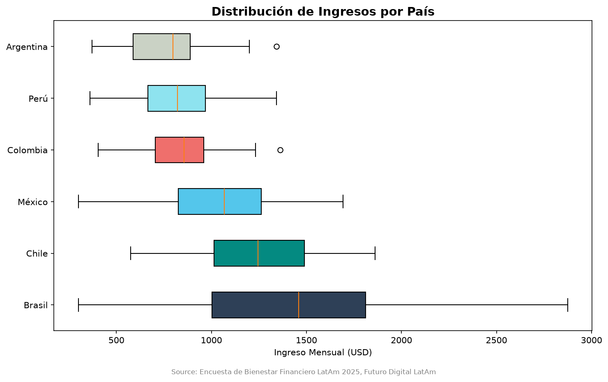
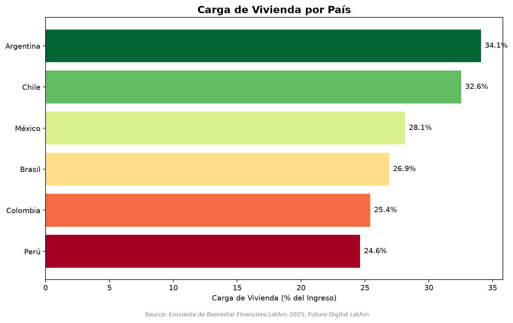
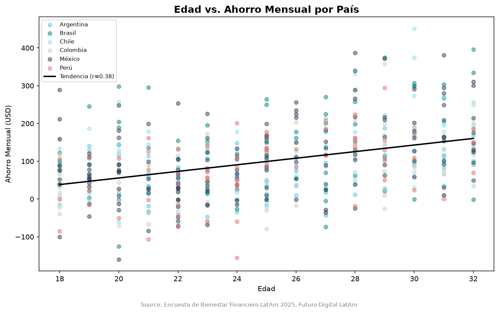
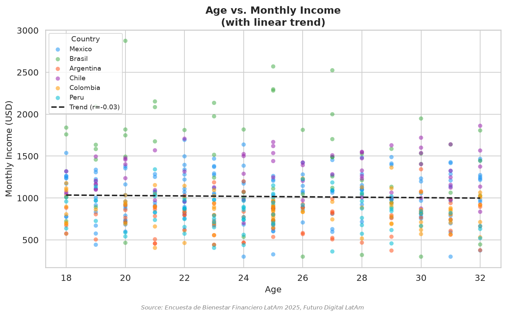
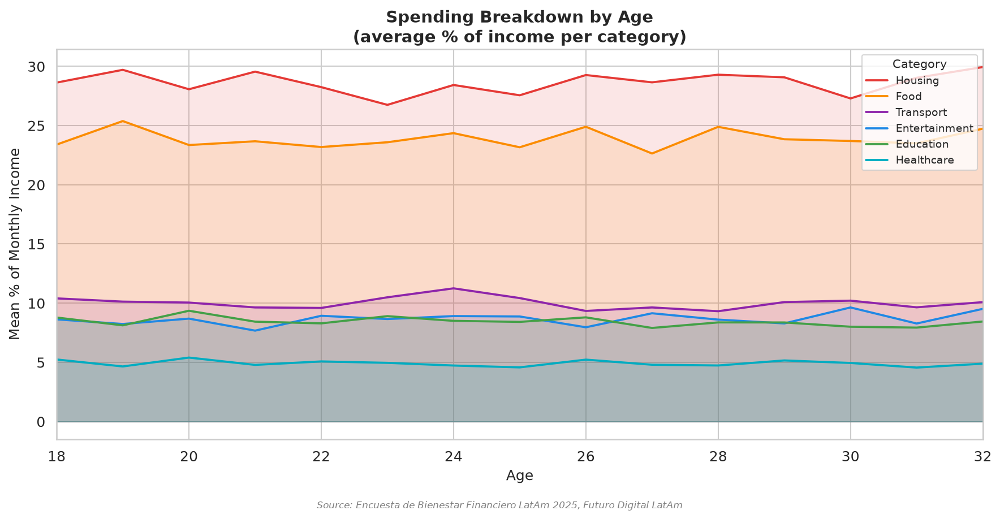
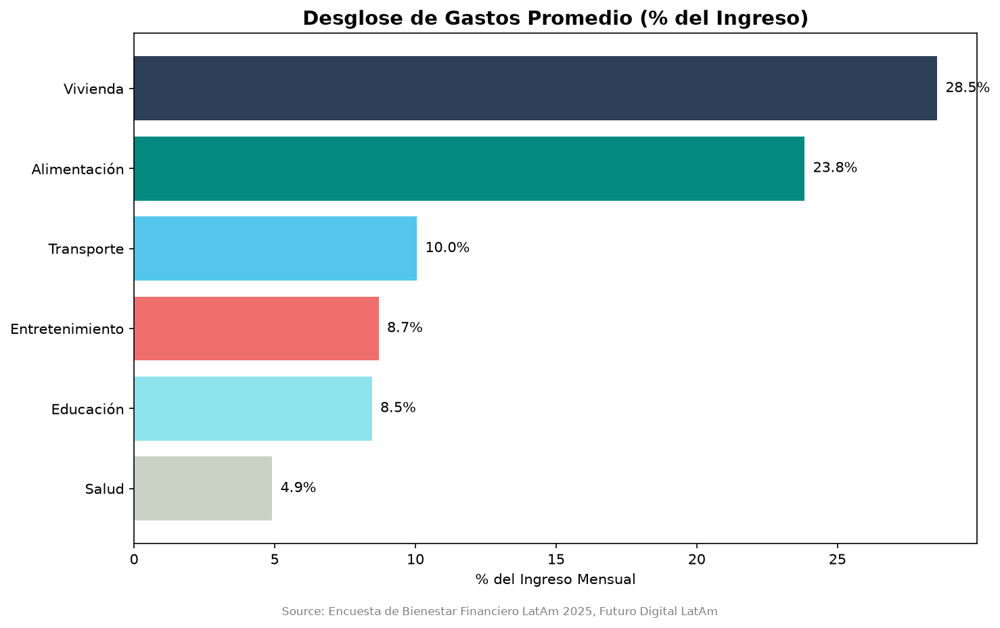
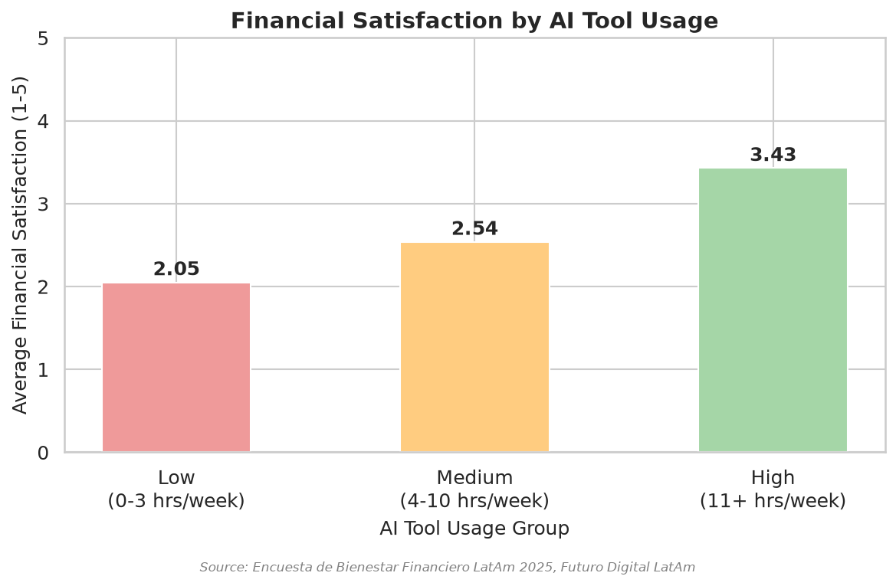
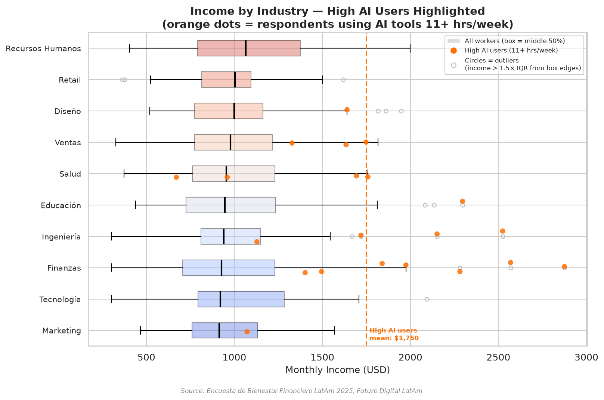
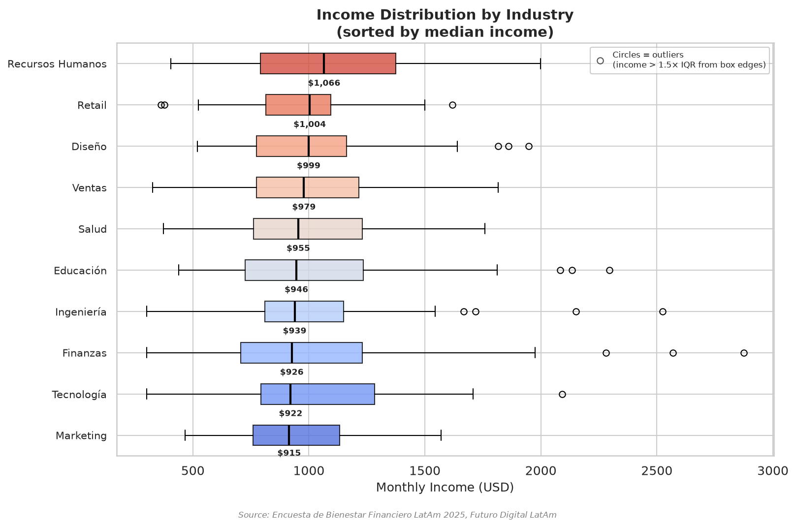

# Datos que Hablan: Bienestar Financiero de Jóvenes Profesionales en América Latina
## Informe Ejecutivo — Futuro Digital LatAm, 2025

---

## 1. Resumen Ejecutivo

This report presents the findings of the *Encuesta de Bienestar Financiero 2025*, a survey of 500 young professionals aged 18–32 across six Latin American countries. The analysis was commissioned by Futuro Digital LatAm to inform the design of a regional financial literacy programme.

Four findings stand out as the most consequential for programme design.

**The savings gap between age groups is a habit gap, not an income gap.** Respondents aged 29–32 save nearly three times more of their income than those aged 18–22 (15.5% vs. 5.7%). Statistical analysis confirms that age does not predict income within this cohort (r = -0.029, p = 0.519), and spending proportions are stable across all ages. The only explanation that survives the data is behavioural: older respondents have developed a savings habit that younger ones have not yet formed. The implication is direct — the programme's highest-leverage intervention is habit formation from the very first paycheck.

**Housing is a structural barrier that no financial literacy programme can fully overcome.** Housing absorbs an average of 28.5% of income across the region, rising to 34.1% in Argentina and 32.6% in Chile. In these markets, a respondent earning the local median has less than two-thirds of their income available for all other expenses combined. Programmes operating here must acknowledge this structural reality before prescribing behaviour change.

**AI tool usage is concentrated among the highest earners within every industry.** Respondents using AI tools 11 or more hours per week report an average income of $1,750/month and a financial satisfaction score of 3.43 out of 5 — versus $747/month and 2.05 for low users. Visualisation confirms these high users are disproportionately drawn from the top of the income distribution within each sector, raising important questions about causality that a controlled pilot should address.

**Industry choice is a weaker income lever than expected.** All ten industries in the dataset share nearly identical median incomes ($915–$1,066), but within-industry variance is enormous — incomes range from $300 to $2,874 within the same sector. At early-career stage, how one manages their trajectory matters far more than which industry they enter.

**Three key recommendations:** (1) Target the 18–22 cohort with a habit-first savings curriculum — not income-contingent advice. (2) Build country-specific modules that calibrate all financial targets to local income and housing realities. (3) Pilot an AI literacy component as a controlled experiment, measuring whether tool adoption among lower-income participants produces measurable improvements in financial outcomes over time.

---

## 2. Metodología

### Dataset

**Survey:** Encuesta de Bienestar Financiero 2025  
**Conducted by:** Futuro Digital LatAm  
**Sample:** 500 respondents across 6 Latin American countries  
**Target population:** Young professionals aged 18–32  
**Variables collected:** 21 variables covering income, spending by category, savings, debt, credit card ownership, savings account ownership, AI tool usage, financial satisfaction, occupation, and industry  

### Data Processing

Raw survey data was imported as a CSV file (UTF-8 encoded) and processed through a two-phase pipeline: exploratory analysis to identify quality issues, followed by systematic cleaning and standardisation. The cleaned dataset contains **500 rows and 22 columns** (one column added during cleaning). No rows were dropped.

### Data Quality Issues Resolved

Eight data quality issues were identified and resolved during Phase 2:

| # | Column | Problem | Rows Affected | Resolution |
|---|--------|---------|:---:|-----------|
| 1 | `industria` | Three inconsistent spellings for the same industry (`"Tecnologia"`, `"tech"`, `"TECNOLOGÍA"`) | 10 | Merged into `"Tecnología"` |
| 2 | `gasto_salud_usd` | 33 missing values (6.6% of rows) | 33 | Filled with column median ($45.66) |
| 3 | `ahorro_mensual_usd` | 74 records with negative values (spending exceeds income) | 74 | Flagged in new column `ahorro_negativo`; values retained |
| 4 | `pais` | Special character artifacts (`M?xico`, `Per?`) in some environments | 0* | No change — values were correctly stored in UTF-8; issue was terminal rendering |
| 5 | `tiene_tarjeta_credito` | Value `"Sí"` contained special character | 284 | Normalised to `"Si"` |
| 6 | `tiene_cuenta_ahorro` | Value `"Sí"` contained special character | 362 | Normalised to `"Si"` |
| 7 | `tiene_deuda` | Value `"Sí"` contained special character | 234 | Normalised to `"Si"` |
| 8 | `ocupacion` | Mojibake encoding: `"Diseñador Gráfico"` | 56 | Corrected to `"Diseñador Grafico"` |

*Country names were correctly stored in UTF-8; the display artifact was a Windows terminal encoding limitation (cp1252).

---

## 3. Perfil de la Muestra

### Countries and Sample Sizes

| Country | Respondents | % of Sample | Median Income (USD/month) |
|---------|:-----------:|:-----------:|:-------------------------:|
| México | 150 | 30.0% | $1,066.99 |
| Colombia | 80 | 16.0% | $856.62 |
| Argentina | 70 | 14.0% | $798.49 |
| Chile | 70 | 14.0% | $1,246.01 |
| Perú | 65 | 13.0% | $821.59 |
| Brasil | 65 | 13.0% | $1,458.03 |
| **Total** | **500** | **100%** | **$960.34** |

### Age Distribution

| Age Group | Respondents | % of Sample |
|-----------|:-----------:|:-----------:|
| 18–22 | 162 | 32.4% |
| 23–25 | 123 | 24.6% |
| 26–28 | 87 | 17.4% |
| 29–32 | 128 | 25.6% |

The sample skews slightly younger, with the 18–22 cohort being the largest single group (32.4%).

### Industries Represented

| Industry | Respondents |
|----------|:-----------:|
| Finanzas | 66 |
| Tecnología | 57 |
| Ingeniería | 53 |
| Ventas | 51 |
| Salud | 49 |
| Marketing | 49 |
| Educación | 45 |
| Diseño | 45 |
| Recursos Humanos | 44 |
| Retail | 41 |

Distribution across industries is relatively balanced (41–66 respondents per sector), reducing the risk of any single industry disproportionately driving aggregate results.

### Occupations

Ten occupations are represented, each with 43–56 respondents: Diseñador Gráfico, Ingeniero, Community Manager, Gerente de Proyectos, Contador, Analista Financiero, Representante de Ventas, Coordinador de Marketing, Especialista en RRHH, and Docente.

### Key Financial Indicators — Full Sample

| Indicator | Value |
|-----------|-------|
| Mean monthly income | $1,016.80 |
| Median monthly income | $960.34 |
| Mean monthly savings | $99.00 |
| Respondents with negative savings | 74 (14.8%) |
| Respondents with a credit card | 284 (56.8%) |
| Respondents with a savings account | 362 (72.4%) |
| Respondents carrying debt | 234 (46.8%) |
| Mean weekly AI tool usage | 5.41 hours |
| Mean financial satisfaction (1–5) | 2.48 |

The mean financial satisfaction score of 2.48 out of 5 indicates that the majority of respondents feel financially insecure — a finding that runs as an undercurrent through every analysis in this report.

---

## 4. Hallazgos

### 4.1 Income Distribution Across the Region

Median monthly income varies by **83%** across the six countries surveyed, from **$798 in Argentina** to **$1,458 in Brasil**. Chile ($1,246) and Brasil stand apart as the highest-earning markets; Argentina, Perú, and Colombia cluster at the lower end.

*Figure 1. Horizontal box plots showing the full income distribution for each country, sorted by median. The black line inside each box marks the median; circles represent outliers (income > 1.5× IQR from box edges).*

The income gap between countries is not simply a reflection of cost-of-living differences. **Housing burden data reinforces this disparity.** Argentina's respondents spend **34.1% of their income on housing** — the highest in the dataset — despite having the lowest median income. Chile follows at 32.6%. Perú (24.6%) and Colombia (25.4%) carry the lightest burden relative to income, despite also having lower absolute earnings.

*Figure 5. Average housing cost as a percentage of monthly income, by country. Colour gradient runs from green (lowest burden) to red (highest).*

The combination of low income and high housing costs creates a structurally compressed margin for saving in markets like Argentina. A programme that applies a single savings benchmark across the region will feel unrealistic to participants in the most constrained markets and insufficiently ambitious in higher-income ones.

---

### 4.2 Age, Savings Behaviour, and Income

Respondents aged 29–32 save an average of **$154/month** — more than double the **$61/month** saved by the 18–22 cohort. As a share of income, the gap is even wider: **15.5% vs. 5.7%**.

*Figure 2. Scatter plot of age against monthly savings, coloured by country. The dashed black line shows the linear trend; the dashed red line marks zero savings.*

The instinctive explanation — that older respondents save more because they earn more — does not hold. A regression of age against monthly income produces **r = -0.029 (p = 0.519)**: effectively zero, and statistically non-significant. Knowing a respondent's age tells us almost nothing about their income.

*Figure 7. Scatter plot of age against monthly income. The essentially flat trend line (r = -0.029) confirms that income does not rise systematically with age within the 18–32 range.*

A second supplementary analysis — plotting spending categories as a share of income across all ages — reveals that spending proportions are **equally stable**: housing, food, transport, entertainment, education, and healthcare all follow near-flat trajectories from age 18 to 32.

*Figure 6. Area chart showing average spending in each category as a percentage of income, across ages 18–32. The stability of all six lines confirms that spending behaviour does not change meaningfully with age.*

With income and spending proportions both flat across ages, only one explanation survives: **the savings gap is purely behavioural**. Older respondents in this cohort do not earn more, and they do not spend less proportionally — they have simply developed the habit of saving. This is the most actionable finding in the dataset.

---

### 4.3 Where the Money Goes: Spending Breakdown

On average, **housing (28.5%) and food (23.8%)** together consume **more than half** of respondents' monthly income, leaving 47.7% to cover transport, entertainment, education, healthcare, and savings combined.

*Figure 3. Average spending in each category as a percentage of monthly income, full sample (n = 500).*

| Category | Mean % of Income |
|----------|:----------------:|
| Housing | **28.5%** |
| Food | **23.8%** |
| Transport | 10.1% |
| Entertainment | 8.7% |
| Education | 8.5% |
| Healthcare | 4.9% |

The practical implication for programme design: cutting entertainment entirely would recover only **8.7 percentage points** of income — a modest gain that requires significant behavioural effort. Programmes that focus primarily on discretionary spending cuts are addressing the wrong lever. The structural weight of fixed costs (housing, food) must be acknowledged before discretionary advice is offered.

---

### 4.4 Credit Card Holders vs. Non-Holders

Respondents who hold a credit card spend **16.1% more on food** and **17.2% more on entertainment** than those without one. Yet they also save **6.7% more per month** ($101.75 vs. $95.39). Their income is only marginally higher (+1.5%), suggesting the difference in spending behaviour is driven by access and financial engagement rather than income.

This finding challenges the assumption that credit cards are inherently harmful to savings. Credit card holders appear to both spend and save more — a pattern more consistent with greater financial engagement overall than with reckless consumption. However, without data on credit card debt repayment rates, both interpretations remain plausible: these respondents may be managing credit skillfully, or they may be financing higher consumption through revolving debt that is not captured in this dataset. Either way, the pattern aligns with a broader theme visible across this dataset: the respondents who engage most actively with financial tools and instruments — whether credit cards, AI tools, or structured savings accounts — tend to show better financial outcomes than those who do not. Credit card ownership appears to be one marker of that engagement, not a cause of it.

---

### 4.5 AI Tool Usage and Financial Satisfaction

Respondents are divided into three groups by weekly AI tool usage:

| Usage Group | Respondents | Avg. Satisfaction (1–5) | Avg. Income (USD) |
|-------------|:-----------:|:----------------------:|:-----------------:|
| Low (0–3 hrs/week) | — | **2.05** | **$747** |
| Medium (4–10 hrs/week) | — | 2.67 | $975 |
| High (11+ hrs/week) | — | **3.43** | **$1,750** |

The Pearson correlation between AI usage hours and financial satisfaction is **r = 0.57 (p < 0.0001)** — statistically significant and moderately strong.

*Figure 4. Average financial satisfaction score (1–5) for each AI tool usage group.*

The $1,750 average income among high AI users appears to contradict Finding 4.6, which shows all industry medians fall between $915 and $1,066. The two figures are compatible once the mechanism is understood: chart 09 reveals that high AI users are not evenly distributed across the income spectrum. They are concentrated **at the upper end of the income distribution within every industry** — disproportionately representing the same high-earning individuals visible as outlier circles in Figure 8.

*Figure 9. Industry income box plots with high AI users (11+ hrs/week) overlaid as orange dots. The dashed orange line marks the group mean of $1,750. The majority of orange dots sit above the median line of their respective industry box.*

This pattern has two possible interpretations. High AI usage may cause better financial outcomes by improving decision-making and productivity. Alternatively, higher earners may simply have more resources and motivation to adopt AI tools, and their income advantage predates their tool usage. The data cannot distinguish between these explanations — a controlled pilot is necessary before drawing programme conclusions.

---

### 4.6 Income Distribution by Industry

Median monthly income across the ten industries surveyed spans only **$151** — from **$915 (Marketing)** to **$1,066 (Recursos Humanos)**, a difference of 16.5%.

*Figure 8. Horizontal box plots showing income distribution by industry, sorted by median. Circles represent outliers (income > 1.5× IQR from box edges).*

| Industry | Median Income | Min | Max |
|----------|:-------------:|:---:|:---:|
| Marketing | $915 | $467 | $1,569 |
| Tecnología | $922 | $300 | $2,092 |
| Finanzas | $926 | $300 | $2,874 |
| Ingeniería | $939 | $300 | $2,524 |
| Educación | $946 | $439 | $2,296 |
| Salud | $955 | $374 | $1,758 |
| Ventas | $979 | $327 | $1,817 |
| Diseño | $999 | $520 | $1,948 |
| Retail | $1,004 | $362 | $1,619 |
| Recursos Humanos | $1,066 | $405 | $1,999 |

While the medians are nearly identical, **within-industry variance is substantial**: in Finanzas, the range runs from $300 to $2,874 — a spread nearly ten times the gap between the highest and lowest industry medians. This means that at the early-career stage, **which industry a respondent works in is a far weaker predictor of income than their position within that industry**.

---

## 5. Recomendaciones

**1. Make habit formation — not income growth — the centrepiece of the programme's savings curriculum.**
Findings 4.2, and the combined evidence of Figures 2, 6, and 7, show that the savings gap between young and older respondents cannot be explained by income or spending differences. It is entirely behavioural. The programme should introduce a habit-first savings framework from the very first module — automating a fixed transfer at the moment of income receipt, before discretionary spending begins. Concrete, small initial goals (e.g., 5% of income) targeted at the 18–22 cohort represent the highest-leverage opportunity for long-term impact.

**2. Build country-specific modules with locally calibrated financial benchmarks.**
Finding 4.1 demonstrates an 83% income gap between the highest- and lowest-earning countries, compounded by housing burden differences of nearly 10 percentage points between Argentina (34.1%) and Perú (24.6%). A savings goal, emergency fund target, or investment threshold that is achievable in Brasil may be structurally out of reach for an Argentine respondent on the local median income. All programme modules should include country-specific variants with targets calibrated to local median income and housing cost realities. For Argentina and Chile specifically, supplementary content on housing cost management — tenant rights, rental negotiation, and subsidy access — is warranted.

**3. Develop a responsible credit module that goes beyond debt warnings.**
Finding 4.4 shows that credit card holders spend more but also save more — a profile consistent with active financial management rather than reckless consumption. The programme should include a module on using credit as a cash-flow tool: payment timing, reward optimisation, and the critical distinction between revolving debt and monthly settlement. This framing is more likely to produce positive outcomes than a curriculum that treats credit access as inherently risky.

**4. Pilot an AI literacy component as a controlled experiment — not an assumed intervention.**
The correlation between AI tool usage and financial satisfaction (r = 0.57, p < 0.0001) and the income concentration pattern visible in Figure 9 are compelling signals. However, the direction of causality cannot be established from this dataset. The programme should pilot a dedicated AI literacy module — focused on budgeting, expense tracking, and goal-setting tools — with a control group, and measure whether adoption among lower-income participants produces measurable improvements in financial satisfaction and savings over a 6-month follow-up period. The module should frame AI as a practical daily resource, not a technical subject.

**5. Incorporate a session on income growth levers within careers.**
Finding 4.6 shows that industry choice barely moves the needle on income at the early-career stage — the median difference between the highest- and lowest-paying sectors is only $151. The real income variation happens within industries, driven by specialisation, country of residence, and employer access. The programme should include a session on career trajectory management: skill development, salary negotiation, and lateral movement to higher-paying roles within the same sector. Presenting concrete within-industry income ranges to participants can shift their mental model from passive acceptance of an "industry salary" toward active management of their earning trajectory.

---

## 6. Conclusión

The *Encuesta de Bienestar Financiero 2025* paints a consistent picture of a generation navigating early adulthood under real financial pressure — with a mean satisfaction score of 2.48 out of 5, nearly 15% spending more than they earn each month, and housing consuming a third of income in some markets before any other decision is made.

Yet the data also carries a message of genuine opportunity. The savings gap that separates younger from older respondents in this cohort is not a function of income, industry, or spending priorities — all three are remarkably stable across the 18–32 age range. It is a function of habit. That is the most actionable finding in this report: the barrier to better financial outcomes for young Latin American professionals is not structural scarcity but the absence of a deliberate savings routine, established early.

The data also reveals that engagement is the real differentiator. Respondents who interact actively with financial tools — credit cards, AI applications, savings accounts — consistently show better outcomes than those who do not. This suggests that financial literacy programmes are most effective not when they deliver information, but when they change the relationship a person has with their own money: making it visible, trackable, and worth paying attention to on a daily basis.

For Futuro Digital LatAm, this means the highest-leverage investment is a programme that reaches people at 18 — before habits calcify — and equips them not with aspirational targets they cannot yet meet, but with concrete systems they can start on their next paycheck.

---

*Report prepared by: Data Analysis Team — Futuro Digital LatAm Capstone Project, 2025*  
*Dataset: Encuesta de Bienestar Financiero 2025 | n = 500 | 6 countries | Ages 18–32*
